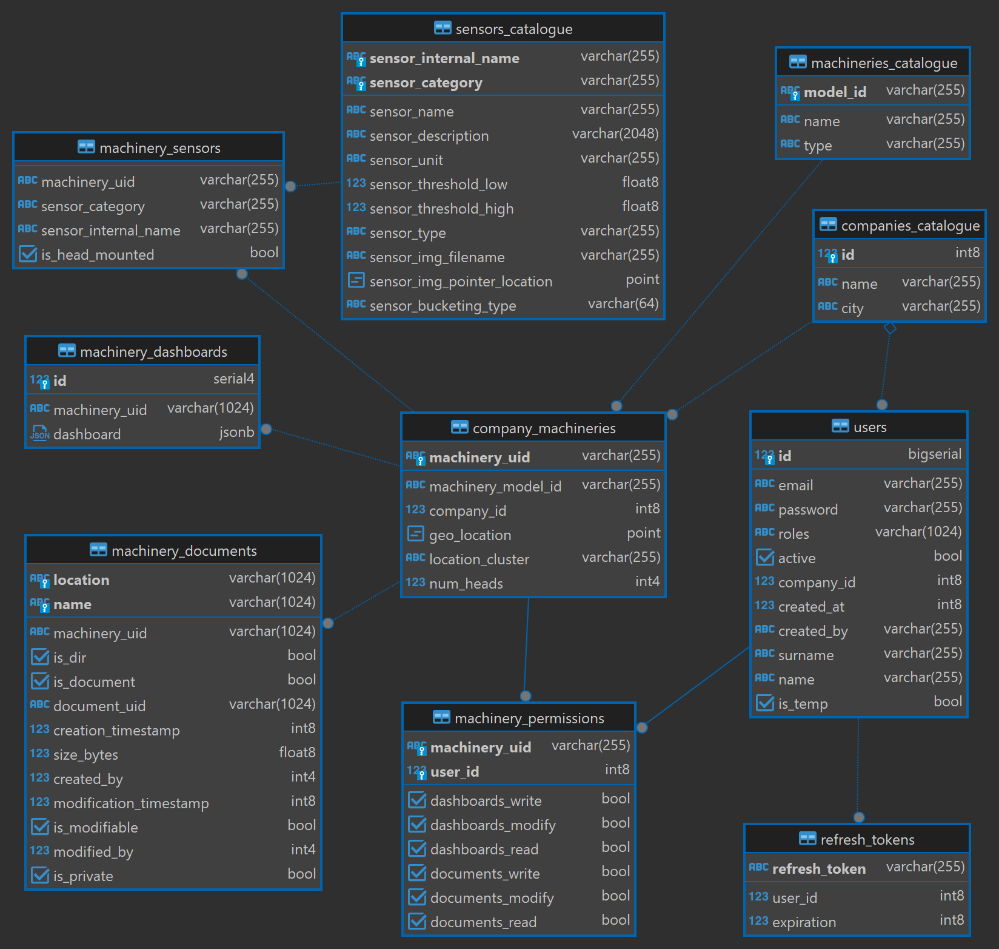

# AROL-CLOUD (SDP Project Group 6)

## How to run project 

### Local

#### Set up env file

Step 1: `cd ./express-server` and create a file name ".env"

Step 2: Paste the following content in it

```env
JWT_SECRET_KEY=6c9c23d766e7cf2280dfdb8fca8f97841ddcd80eee01eb0cbaff85037848962f
JWT_EXPIRATION=900000
REFRESH_TOKEN_SECRET_KEY=47e648a61b5c7c8b3d12bb9c46dbc64f35fd2d3fb22bfc5debc9d7cf6036ff1b
REFRESH_TOKEN_EXPIRATION=2592000000
POSTGRES_HOST=localhost
POSTGRES_PORT=5432
POSTGRES_USER=postgres
POSTGRES_PASSWORD=postgres
MONGODB_HOST=localhost
MONGODB_PORT=27017
```

#### Important note

To run project locally, PostgreSQL and MongoDB need to be installed in the system. DB configuration scripts/exports for both
DBMS-es can be found under `Docker/pg` and `Docker/mongo/data` dirs. These exports need to be imported into the corresponding DBMS manually.

#### Run server

Step 1: `cd ./express-server`

Step 2: `npm install --force`

Step 3: `npm run start:dev`

#### Run client

Step 1: `cd ./react-client`

Step 2: `npm install --force`

Step 3: `npm run start`

### Docker

Step 1: `Make sure you have Docker installed locally on your system`

Step 2: `cd ./Docker`

Step 3: `docker compose up --build`

Step 4: `Open Docker Desktop and make sure to run all the containers under the "arol-cloud" container`

Step 5: `Open http://localhost:3000 on you favourite browser`

## DB Schema 



### Credentials

username: `postgres`

password: `postgres`

port: `5432`

### Available users and credentials

#### AROL

- _Chief_

  - username: `giuseppe.ferrari@arol.it`
  - password: `chief0`

- _Supervisor_

  - username: `elena.verdi@arol.it`
  - password: `supervisor0`

- _Officer_
  - username: `gualtiero.bianchi@arol.it`
  - password: `officer0`

#### Company 1

- _Administrator_

  - username: `mariodeda@hotmail.com`
  - password: `123`

- _Worker_

  - username: `mariodeda2@hotmail.com`
  - password: `123`

- _Worker_

  - username: `test2@hotmail.com`
  - password: `12345678`

- _Worker, Manager_
  - username: `worker@hotmail.com`
  - password: `12345678`

#### Company 2

- _Administrator_

  - username: `alessandro.rossi@company2.com`
  - password: `admin2`

- _Worker_

  - username: `luca.fanti@company2.com`
  - password: `worker2`

- _Worker_

  - username: `matteo.bianchi@company2.com`
  - password: `worker2`

- _Worker, Manager_
  - username: `marta.mancini@company2.com`
  - password: `workmng2`

#### Company 3

- _Administrator_

  - username: `sofia.conti@company3.com`
  - password: `admin3`

- _Worker_

  - username: `paolo.bitta@company3.com`
  - password: `worker3`

- _Worker_

  - username: `luca.nervi@company3.com`
  - password: `worker3`

- _Worker, Manager_
  - username: `iliaria.tanadale@company3.com`
  - password: `workmng3`

#### PoliTO S.R.L.

- _Administrator_

  - username: `daniele.gallo@company4.com`
  - password: `admin4`

- _Worker_

  - username: `davide.colombo@company4.com`
  - password: `worker4`

- _Worker_

  - username: `francesco.esposito@company4.com`
  - password: `worker4`

- _Worker, Manager_
  - username: `aurora.lombardi@company4.com`
  - password: `workmng4`

## API Documentation

Base URLs: [http://localhost:8080](http://localhost:8080)

Email: [support](mailto:mariodeda@hotmail.com)

### Authentication

HTTP Authentication

#### Scheme

bearer

### public 

Public operations (no auth token needed)

- _post\_\_public\_login_

  `POST /public/login`

  _Initial authentication_

  Perform initial authentication to obtain JWT auth token

  _Body parameter_

  ```json
  {
    "email": "example@email.com",
    "password": 12345678
  }
  ```

  _Parameters_

  | Name       | In   | Type                                  | Required | Description |
  | ---------- | ---- | ------------------------------------- | -------- | ----------- |
  | body       | body | [LoginCredentials](#logincredentials) | true     | none        |
  | » email    | body | string                                | true     | none        |
  | » password | body | string                                | true     | none        |

  _Example responses_

  > 200 Response

  ```json
  {
    "id": 0,
    "companyID": 1,
    "name": "string",
    "surname": "string",
    "email": "string",
    "roles": ["string"],
    "authToken": "string",
    "authTokenExpiration": 0,
    "refreshToken": "string",
    "refreshTokenExpiry": 0,
    "permissions": {
      "machineryUID": {
        "dashboardsWrite": true,
        "dashboardsModify": true,
        "dashboardsRead": true,
        "documentsWrite": true,
        "documentsModify": true,
        "documentsRead": true
      }
    }
  }
  ```

  _Responses_

  | Status | Meaning                                                        | Description                         | Schema                          |
  | ------ | -------------------------------------------------------------- | ----------------------------------- | ------------------------------- |
  | 200    | [OK](https://tools.ietf.org/html/rfc7231#section-6.3.1)        | Successful operation                | [LoginResponse](#loginresponse) |
  | 403    | [Forbidden](https://tools.ietf.org/html/rfc7231#section-6.5.3) | Bad credentials or account disabled | None                            |

  This operation does not require authentication

- _post\_\_public\_logout_

  `POST /public/logout`

  _Logout_

  Perform logout and delete any refresh tokens associated to this session

  _Parameters_

  | Name  | In    | Type    | Required | Description |
  | ----- | ----- | ------- | -------- | ----------- |
  | id    | query | integer | false    | none        |
  | token | query | string  | false    | none        |

  _Responses_

  | Status | Meaning                                                 | Description       | Schema |
  | ------ | ------------------------------------------------------- | ----------------- | ------ |
  | 200    | [OK](https://tools.ietf.org/html/rfc7231#section-6.3.1) | Logout successful | None   |

  This operation does not require authentication

- _get\_\_public\_refreshtoken_

  `GET /public/refreshtoken`

  _JWT token refresh_

  Refresh JWT token by providing a valid refresh token

  _Parameters_

  | Name  | In    | Type    | Required | Description |
  | ----- | ----- | ------- | -------- | ----------- |
  | id    | query | integer | false    | none        |
  | token | query | string  | false    | none        |

  _Example responses_

  > 200 Response

  ```json
  {
    "id": 0,
    "companyID": "string",
    "name": "string",
    "surname": "string",
    "email": "string",
    "roles": ["string"],
    "authToken": "string",
    "authTokenExpiration": 0,
    "refreshToken": "string",
    "refreshTokenExpiry": 0,
    "permissions": {
      "machineryUID": {
        "dashboardsWrite": true,
        "dashboardsModify": true,
        "dashboardsRead": true,
        "documentsWrite": true,
        "documentsModify": true,
        "documentsRead": true
      }
    }
  }
  ```

  _Responses_

  | Status | Meaning                                                          | Description              | Schema                          |
  | ------ | ---------------------------------------------------------------- | ------------------------ | ------------------------------- |
  | 200    | [OK](https://tools.ietf.org/html/rfc7231#section-6.3.1)          | Token refresh successful | [LoginResponse](#loginresponse) |
  | 400    | [Bad Request](https://tools.ietf.org/html/rfc7231#section-6.5.1) | Invalid refresh token    | None                            |
  | 401    | [Unauthorized](https://tools.ietf.org/html/rfc7235#section-3.1)  | Invalid refresh token    | None                            |
  | 403    | [Forbidden](https://tools.ietf.org/html/rfc7231#section-6.5.3)   | Account disabled         | None                            |

  _This operation does not require authentication_

- _get\_\_public\_status_

  `GET /public/status`

  _Health_

  Check server health

  _Responses_

  | Status | Meaning                                                 | Description                         | Schema |
  | ------ | ------------------------------------------------------- | ----------------------------------- | ------ |
  | 200    | [OK](https://tools.ietf.org/html/rfc7231#section-6.3.1) | Server is on and accepting requests | None   |

  This operation does not require authentication

### company 

Operations about companies

- _get\_\_company_all_

  `GET /company/all`

  _All companies information_

  Retrieve information about all companies

  _Example responses_

  > 200 Response

  ```json
  [
    {
      "id": 0,
      "name": "string"
    },
    {
      "id": 1,
      "name": "string"
    },
    ...
  ]
  ```

  _Responses_

  | Status | Meaning                                                         | Description                      | Schema                                       |
  | ------ | --------------------------------------------------------------- | -------------------------------- | -------------------------------------------- |
  | 200    | [OK](https://tools.ietf.org/html/rfc7231#section-6.3.1)         | Companies retrieved successfully | Array of [CompanyResponse](#companyresponse) |
  | 401    | [Unauthorized](https://tools.ietf.org/html/rfc7235#section-3.1) | Authentication failed            | None                                         |
  | 404    | [Not Found](https://tools.ietf.org/html/rfc7231#section-6.5.4)  | No companies found               | None                                         |

  To perform this operation, you must be authenticated by means of one of the following methods:

  - bearerAuth

- _get\_\_company\_{id}_

  `GET /company/:id`

  _Company information_

  Retrive information of a company

  _Example responses_

  > 200 Response

  ```json
  {
    "id": 0,
    "name": "string"
  }
  ```

  _Responses_

  | Status | Meaning                                                         | Description                     | Schema                                |
  | ------ | --------------------------------------------------------------- | ------------------------------- | ------------------------------------- |
  | 200    | [OK](https://tools.ietf.org/html/rfc7231#section-6.3.1)         | Company retrieved successfully  | [CompanyResponse](#companyresponse)   |
  | 401    | [Unauthorized](https://tools.ietf.org/html/rfc7235#section-3.1) | Authentication failed           | None                                  |
  | 404    | [Not Found](https://tools.ietf.org/html/rfc7231#section-6.5.4)  | Company not found               | None                                  |

  To perform this operation, you must be authenticated by means of one of the following methods:

  - bearerAuth

- _post\_\_company\_create_ 

  `POST /company/create`

  _Create company_

  Insert a new company

  _Body parametrs_

  ```json
  {
    "id": 0,
    "name": "string",
    "city": "string",
  }
  ```

  _Parameters_

  | Name      | In   | Type                                          | Required | Description         |
  | --------- | ---- | --------------------------------------------- | -------- | ------------------- |
  | body      | body | [CreateCompanyRequest](#createcompanyrequest) | false    | New company details |
  | » name    | body | string                                        | false    | none                |
  | » city    | body | number                                        | false    | none                |

  _Example responses_

  > 200 Response

  ```json
  {
  "result": true
  }
  ```

  _Responses_

  | Status | Meaning                                                          | Description                   | Schema                              |
  | ------ | ---------------------------------------------------------------- | ----------------------------- | ----------------------------------- |
  | 200    | [OK](https://tools.ietf.org/html/rfc7231#section-6.3.1)          | Company created successfully  | [GenericResponse](#genericresponse) |
  | 400    | [Bad Request](https://tools.ietf.org/html/rfc7231#section-6.5.1) | Failed to created company     | None                                |
  | 403    | [Forbidden](https://tools.ietf.org/html/rfc7231#section-6.5.3)   | Insufficient permissions      | None                                |

- _post\_\_company\_update_

  `POST /company/update`

  _Update company_

  Modify information about a company

  ```json
  {
    "id": 0,
    "name": "string",
    "city": "string",
  }
  ```

  _Parameters_

  | Name      | In   | Type                                          | Required | Description         |
  | --------- | ---- | --------------------------------------------- | -------- | ------------------- |
  | body      | body | [UpdateCompanyRequest](#updatecompanyrequest) | false    | New company details |
  | » id      | body | number                                        | false    | none                |
  | » name    | body | string                                        | false    | none                |
  | » city    | body | number                                        | false    | none                |

  _Example responses_

  > 200 Response

  ```json
  {
  "result": true
  }
  ```

  _Responses_

  | Status | Meaning                                                          | Description                   | Schema                              |
  | ------ | ---------------------------------------------------------------- | ----------------------------- | ----------------------------------- |
  | 200    | [OK](https://tools.ietf.org/html/rfc7231#section-6.3.1)          | Company updated successfully  | [GenericResponse](#genericresponse) |
  | 400    | [Bad Request](https://tools.ietf.org/html/rfc7231#section-6.5.1) | Failed to update company      | None                                |
  | 403    | [Forbidden](https://tools.ietf.org/html/rfc7231#section-6.5.3)   | Insufficient permissions      | None                                |

- _delete\_\_company\_{id}_

  `DELETE /company/:id`

  _Delete company_

  Delete all information about a company

  _Example response_

  > 200 Response

  ```json
  {
    "result": true
  }
  ```

  _Responses_

  | Status | Meaning                                                          | Description                   | Schema                              |
  | ------ | ---------------------------------------------------------------- | ----------------------------- | ----------------------------------- |
  | 200    | [OK](https://tools.ietf.org/html/rfc7231#section-6.3.1)          | Company deleted successfully  | [GenericResponse](#genericresponse) |
  | 400    | [Bad Request](https://tools.ietf.org/html/rfc7231#section-6.5.1) | Failed to delete company      | None                                |
  | 403    | [Forbidden](https://tools.ietf.org/html/rfc7231#section-6.5.3)   | Cannot delete AROL company    | None                                |

### machinery 

Operations on company machineries by AROL and company users

- _get\_\_machinery_all_

  `GET /machinery/all`

  _All machineries_

  Get all the machineries for the authenticated AROL user

  _Example responses_

  > 200 Response

  ```json
  {
    "locationCluster": [
      {
        "uid": "string",
        "companyID": 0,
        "modelID": "string",
        "modelName": "string",
        "modelType": "string",
        "geoLocation": {
          "x": 0,
          "y": 0
        },
        "locationCluster": "string",
        "numHeads": 0
      }
    ]
  }
  ```

  _Responses_

  | Status | Meaning                                                                    | Description                                                                                                                                              | Schema                                                    |
  | ------ | -------------------------------------------------------------------------- | -------------------------------------------------------------------------------------------------------------------------------------------------------- | --------------------------------------------------------- |
  | 200    | [OK](https://tools.ietf.org/html/rfc7231#section-6.3.1)                    | Company machineries groupped by their corresponding location cluster. Each cluster contains the actual array of machineries that belong to that cluster. | [CompanyMachineriesResponse](#companymachineriesresponse) |
  | 400    | [Bad Request](https://tools.ietf.org/html/rfc7231#section-6.5.1)           | Invalid company ID detected                                                                                                                              | None                                                      |
  | 401    | [Unauthorized](https://tools.ietf.org/html/rfc7235#section-3.1)            | Authentication failed                                                                                                                                    | None                                                      |
  | 403    | [Forbidden](https://tools.ietf.org/html/rfc7231#section-6.5.3)             | Insufficient permissions                                                                                                                                 | None                                                      |

  ***Warning***

  To perform this operation, you must be authenticated by means of one of the following methods:

  - bearerAuth

- _get\_\_machinery\_all\_{companyID}_

  `GET /machinery/all/{companyID}`

  _All Machinery by CompanyID_

  Get all the company machineries for the authenticated user by company ID

  _Parameters_

  | Name      | In   | Type   | Required | Description                                               |
  | --------- | ---- | ------ | -------- | --------------------------------------------------------- |
  | companyID | path | number | true     | The company ID for which the machineries must be returned |

  _Example responses_

  > 200 Response

  ```json
  {
    "uid": "string",
    "companyID": 0,
    "modelID": "string",
    "modelName": "string",
    "modelType": "string",
    "geoLocation": {
      "x": 0,
      "y": 0
    },
    "locationCluster": "string",
    "numHeads": 0
  }
  ```

  _Responses_

  | Status | Meaning                                                                    | Description                                    | Schema                                                    |
  | ------ | -------------------------------------------------------------------------- | ---------------------------------------------- | --------------------------------------------------------- |
  | 200    | [OK](https://tools.ietf.org/html/rfc7231#section-6.3.1)                    | List of machinery for a specific company       | [CompanyMachineriesResponse](#companymachineriesresponse) |
  | 400    | [Bad Request](https://tools.ietf.org/html/rfc7231#section-6.5.1)           | Invalid company ID detected                    | None                                                      |
  | 401    | [Unauthorized](https://tools.ietf.org/html/rfc7235#section-3.1)            | Authentication failed                          | None                                                      |
  | 403    | [Forbidden](https://tools.ietf.org/html/rfc7231#section-6.5.3)             | Insufficient permissions                       | None                                                      |
  | 404    | [Not Found](https://tools.ietf.org/html/rfc7231#section-6.5.4)             | Machineries for company ID passed is not found | None                                                      |

  ***Warning***

  To perform this operation, you must be authenticated by means of one of the following methods:

  - bearerAuth

- _get\_\_machinery\_details\_{modelID}_

  `GET /machinery/details/{modelID}`

  _Machinery details by modelID_

  Get details for the machinery that has the modelID passed as parameter

  _Parameters_

  | Name    | In   | Type   | Required | Description                                  |
  | ------- | ---- | ------ | -------- | -------------------------------------------- |
  | modelID | path | string | true     | Ther modelID for which details are requested |

  _Example responses_

  > 200 Response

  ```json
  {
    "modelID": "MMMMM",
    "name": "string",
    "type": "string"
  }
  ```

  _Responses_

  | Status | Meaning                                                                    | Description                                  | Schema                                                |
  | ------ | -------------------------------------------------------------------------- | -------------------------------------------- | ----------------------------------------------------- |
  | 200    | [OK](https://tools.ietf.org/html/rfc7231#section-6.3.1)                    | Machinery details for the selected machinery | [MachineryDetailsResponse](#machinerydetailsresponse) |
  | 400    | [Bad Request](https://tools.ietf.org/html/rfc7231#section-6.5.1)           | Invalid model ID detected                    | None                                                  |
  | 401    | [Unauthorized](https://tools.ietf.org/html/rfc7235#section-3.1)            | Authentication failed                        | None                                                  |
  | 403    | [Forbidden](https://tools.ietf.org/html/rfc7231#section-6.5.3)             | Insufficient permissions                     | None                                                  |
  | 404    | [Not Found](https://tools.ietf.org/html/rfc7231#section-6.5.4)             | Machineries for model ID passed is not found | None                                                  |

  ***Warning***

  To perform this operation, you must be authenticated by means of one of the following methods:

  - bearerAuth

- _get\_\_machinery\_sensors\_all_

  `GET /sensors/catalogue/all`

  _Sensors Catalogue_

  Get the catalogue of all available sensors

  _Example responses_

  > 200 Response

  ```json
  [
    {
      "sensorName": "string",
      "sensorDescription": "string",
      "sensorUnit": "string",
      "sensorThresholdLow": 0.0,
      "sensorThresHoldHigh": 1.0,
      "sensorInternalName": "string",
      "sensorCategory": "string",
      "sensorType": "string",
      "sensorImgFilename": "string",
      "imgPointerLocation": {
        "x": 0,
        "y": 0
      },
      "sensorBucketingType": "string"
    }
  ]
  ```

  _Responses_

  | Status | Meaning                                                                    | Description                   | Schema                                                |
  | ------ | -------------------------------------------------------------------------- | ----------------------------- | ----------------------------------------------------- |
  | 200    | [OK](https://tools.ietf.org/html/rfc7231#section-6.3.1)                    | List of all available sensors | [SensorsCatalogueResponse](#sensorscatalogueresponse) |
  | 400    | [Bad Request](https://tools.ietf.org/html/rfc7231#section-6.5.1)           | Errors in request message     | None                                                  |
  | 401    | [Unauthorized](https://tools.ietf.org/html/rfc7235#section-3.1)            | Authentication failed         | None                                                  |
  | 403    | [Forbidden](https://tools.ietf.org/html/rfc7231#section-6.5.3)             | Insufficient permissions      | None                                                  |

  ***Warning***

  To perform this operation, you must be authenticated by means of one of the following methods:

  - bearerAuth

- _get\_\_machinery\_{machineryUID}_

  `GET /machinery/:machineryUID`

  _Machinery by UID_

  Get the machinery informati for the authenticated user by machinery UID

  _Parameters_

  | Name         | In   | Type   | Required | Description                                  |
  | ------------ | ---- | ------ | -------- | -------------------------------------------- |
  | machineryUID | path | number | true     | The machinery UID of the requested machinery |

  _Example responses_

  > 200 Response

  ```json
  {
    "uid": "string",
    "companyID": 0,
    "modelID": "string",
    "modelName": "string",
    "modelType": "string",
    "geoLocation": {
      "x": 0,
      "y": 0
    },
    "locationCluster": "string",
    "numHeads": 0
  }
  ```

  _Responses_

  | Status | Meaning                                                                    | Description                                                    | Schema                        |
  | ------ | -------------------------------------------------------------------------- | -------------------------------------------------------------- | ----------------------------- |
  | 200    | [OK](https://tools.ietf.org/html/rfc7231#section-6.3.1)                    | Machinery details for the given UID                            | [MachinerySchema](#machinery) |
  | 400    | [Bad Request](https://tools.ietf.org/html/rfc7231#section-6.5.1)           | Missing user details or invalid machinery UID detected         | None                          |
  | 403    | [Forbidden](https://tools.ietf.org/html/rfc7231#section-6.5.3)             | Insufficient permissions or machinery not owned by the company | None                          |
  | 404    | [Not Found](https://tools.ietf.org/html/rfc7231#section-6.5.4)             | Machinery not found                                            | None                          |

  ***Warning***

  To perform this operation, you must be authenticated by means of one of the following methods:

  - bearerAuth

- _get\_\_machinery\_sensors\_{machineryUID}_

  `GET /machinery/sensors/{machineryUID}`

  _Get Machinery Sensors by MachineryUID_

  Get sensors associated to the machinery defined by the machineryUID as parameter

  _Parameters_

  | Name         | In   | Type | Required | Description                                       |
  | ------------ | ---- | ---- | -------- | ------------------------------------------------- |
  | machineryUID | path | type | true     | The machinery UID required to get related sensors |

  _Example responses_

  > 200 Response

  ```json
  {
    "sensorName": "string",
    "sensorDescription": "string",
    "sensorUnit": "string",
    "sensorThresholdLow": 0.0,
    "sensorThresHoldHigh": 1.0,
    "sensorInternalName": "string",
    "sensorCategory": "string",
    "sensorType": "string",
    "sensorImgFilename": "string",
    "imgPointerLocation": {
      "x": 0,
      "y": 0
    },
    "sensorBucketingType": "string",
    "machineryUID": "MMMMM",
    "isHeadMounted": false
  }
  ```

  _Responses_

  | Status | Meaning                                                                    | Description                                          | Schema                                                |
  | ------ | -------------------------------------------------------------------------- | ---------------------------------------------------- | ----------------------------------------------------- |
  | 200    | [OK](https://tools.ietf.org/html/rfc7231#section-6.3.1)                    | List of sensors associated to the specific machinery | [MachinerySensorsResponse](#machinerysensorsresponse) |
  | 400    | [Bad Request](https://tools.ietf.org/html/rfc7231#section-6.5.1)           | Invalid machinery UID detected                       | None                                                  |
  | 401    | [Unauthorized](https://tools.ietf.org/html/rfc7235#section-3.1)            | Authentication failed                                | None                                                  |
  | 403    | [Forbidden](https://tools.ietf.org/html/rfc7231#section-6.5.3)             | Insufficient permissions                             | None                                                  |
  | 404    | [Not Found](https://tools.ietf.org/html/rfc7231#section-6.5.4)             | Sensors for machinery UID passed is not found        | None                                                  |

  ***Warning***

  To perform this operation, you must be authenticated by means of one of the following methods:

  - bearerAuth

- _post\_\_machinery\_sensors\_data_

  `POST /machinery/sensors/data`

  _Machinery sensors data by its UID_

  Get the authenticated user company machinery sensors data by its UID. The returned data will be filtered using the parameters sent using the request body.

  _Body parameter_

  ```json
  {
    "sensorFilters": {
      "requestType": "string",
      "cacheDataRequestMaxTime": 0,
      "newDataRequestMinTime": 0,
      "widgetCategory": "string",
      "dataRange": {
        "amount": 0,
        "unit": "string"
      },
      "sensors": {
        "sensorName": [
          {
            "headNumber": 0,
            "mechNumber": 0,
            "sensorNames": [
              {
                "name": "string",
                "color": "string"
              }
            ]
          }
        ]
      },
      "aggregations": [
        {
          "name": "string",
          "color": "string"
        }
      ]
    }
  }
  ```

  _Parameters_

  | Name                       | In    | Type                                          | Required | Description                      |
  | -------------------------- | ----- | --------------------------------------------- | -------- | -------------------------------- |
  | machineryUID               | query | string                                        | true     | The UID of the desired machinery |
  | body                       | body  | [MachineryDataRequest](#machinerydatarequest) | true     | none                             |
  | » sensorFilters            | body  | object                                        | false    | none                             |
  | »» requestType             | body  | string                                        | false    | none                             |
  | »» cacheDataRequestMaxTime | body  | number                                        | false    | none                             |
  | »» newDataRequestMinTime   | body  | number                                        | false    | none                             |
  | »» widgetCategory          | body  | string                                        | false    | none                             |
  | »» dataRange               | body  | object                                        | false    | none                             |
  | »»» amount                 | body  | number                                        | false    | none                             |
  | »»» unit                   | body  | string                                        | false    | none                             |
  | »» sensors                 | body  | object                                        | false    | none                             |
  | »»» sensorName             | body  | [object]                                      | false    | none                             |
  | »»»» headNumber            | body  | number                                        | false    | none                             |
  | »»»» mechNumber            | body  | number                                        | false    | none                             |
  | »»»» sensorNames           | body  | [object]                                      | false    | none                             |
  | »»»»» name                 | body  | string                                        | false    | none                             |
  | »»»»» color                | body  | string                                        | false    | none                             |
  | »» aggregations            | body  | [object]                                      | false    | none                             |
  | »»» name                   | body  | string                                        | false    | none                             |
  | »»» color                  | body  | string                                        | false    | none                             |

  _Example responses_

  > 200 Response

  ```json
  {
    "requestType": "string",
    "minDisplayTime": 0,
    "cachedSensorData": {
      "active": true,
      "machineryOff": true,
      "machineryOffFrom": 0,
      "machineryOffTo": 0,
      "time": 0,
      "minTime": 0,
      "maxTime": 0,
      "formattedTime": "string",
      "activeData": {
        "sensorInternalName": 0
      },
      "fillerData": {
        "sensorInternalName": 0
      },
      "allData": {
        "sensorInternalName": 0
      },
      "aggregationData": {
        "aggregationName": {
          "value": 0,
          "note": "string"
        }
      }
    },
    "displaySensorData": {
      "active": true,
      "machineryOff": true,
      "machineryOffFrom": 0,
      "machineryOffTo": 0,
      "time": 0,
      "minTime": 0,
      "maxTime": 0,
      "formattedTime": "string",
      "activeData": {
        "sensorInternalName": 0
      },
      "fillerData": {
        "sensorInternalName": 0
      },
      "allData": {
        "sensorInternalName": 0
      },
      "aggregationData": {
        "aggregationName": {
          "value": 0,
          "note": "string"
        }
      }
    },
    "newSensorData": {
      "active": true,
      "machineryOff": true,
      "machineryOffFrom": 0,
      "machineryOffTo": 0,
      "time": 0,
      "minTime": 0,
      "maxTime": 0,
      "formattedTime": "string",
      "activeData": {
        "sensorInternalName": 0
      },
      "fillerData": {
        "sensorInternalName": 0
      },
      "allData": {
        "sensorInternalName": 0
      },
      "aggregationData": {
        "aggregationName": {
          "value": 0,
          "note": "string"
        }
      }
    },
    "numSensorData": 0,
    "endOfData": true
  }
  ```

  _Responses_

  | Status | Meaning                                                                    | Description                 | Schema                                          |
  | ------ | -------------------------------------------------------------------------- | --------------------------- | ----------------------------------------------- |
  | 200    | [OK](https://tools.ietf.org/html/rfc7231#section-6.3.1)                    | Machinery sensors data      | [MachineryDataResponse](#machinerydataresponse) |
  | 400    | [Bad Request](https://tools.ietf.org/html/rfc7231#section-6.5.1)           | Invalid company ID detected | None                                            |
  | 401    | [Unauthorized](https://tools.ietf.org/html/rfc7235#section-3.1)            | Authentication failed       | None                                            |
  | 403    | [Forbidden](https://tools.ietf.org/html/rfc7231#section-6.5.3)             | Insufficient permissions    | None                                            |

  ***Warning***

  To perform this operation, you must be authenticated by means of one of the following methods:

  - bearerAuth

- _post\_\_machinery\_insert_

  `POST /machinery/insert`

  _Creation of a new machinery_

  Creates a new machinery to be associated to a company

  _Body parameters_

  ```json
  {
    "uid": "string",
    "companyID": 0,
    "modelID": "string",
    "modelName": "string",
    "modelType": "string",
    "geoLocation": {
      "x": 0,
      "y": 0
    },
    "locationCluster": "string",
    "numHeads": 0
  }
  ```

  _Parameters_

  | Name | In   | Type                                          | Required | Description |
  | ---- | ---- | --------------------------------------------- | -------- | ----------- |
  | body | body | [MachineryDataRequest](#machinerydatarequest) | true     | none        |

  _Responses_

  | Status | Meaning                                                                    | Description                 | Schema                              |
  | ------ | -------------------------------------------------------------------------- | --------------------------- | ----------------------------------- |
  | 200    | [OK](https://tools.ietf.org/html/rfc7231#section-6.3.1)                    | Insertion flag              | [GenericRespones](#genericresponse) |
  | 400    | [Bad Request](https://tools.ietf.org/html/rfc7231#section-6.5.1)           | Invalid company ID detected | None                                |
  | 401    | [Unauthorized](https://tools.ietf.org/html/rfc7235#section-3.1)            | Authentication failed       | None                                |
  | 403    | [Forbidden](https://tools.ietf.org/html/rfc7231#section-6.5.3)             | Insufficient permissions    | None                                |

  ***Warning***

  To perform this operation, you must be authenticated by means of one of the following methods:

  - bearerAuth

- _post\_\_machinery\_sensor\_insert_

  `POST /machinery/sensors/insert`

  _Creation of a new sensor_

  Creates a new sensor to be inserted in the sensor catalogue

  _Body parameters_

  ```json
  {
    "sensorName": "string",
    "sensorDescription": "string",
    "sensorUnit": "string",
    "sensorThresholdLow": 0.0,
    "sensorThresHoldHigh": 1.0,
    "sensorInternalName": "string",
    "sensorCategory": "string",
    "sensorType": "string",
    "sensorImgFilename": "string",
    "imgPointerLocation": {
      "x": 0,
      "y": 0
    },
    "sensorBucketingType": "string"
  }
  ```

  _Responses_

  | Status | Meaning                                                                    | Description              | Schema                              |
  | ------ | -------------------------------------------------------------------------- | ------------------------ | ----------------------------------- |
  | 200    | [OK](https://tools.ietf.org/html/rfc7231#section-6.3.1)                    | Insertion flag           | [GenericRespones](#genericresponse) |
  | 400    | [Bad Request](https://tools.ietf.org/html/rfc7231#section-6.5.1)           | Invalid sensor specs     | None                                |
  | 401    | [Unauthorized](https://tools.ietf.org/html/rfc7235#section-3.1)            | Authentication failed    | None                                |
  | 403    | [Forbidden](https://tools.ietf.org/html/rfc7231#section-6.5.3)             | Insufficient permissions | None                                |

  ***Warning***

  To perform this operation, you must be authenticated by means of one of the following methods:

  - bearerAuth

- _post\_\_machinery\_modify_

  `POST /machinery/modify`

  _Modification of a company machinery_

  This API is used to change some values for a company machinery

  _Body parameters_

  ```json
  {
    "uid": "string",
    "companyID": 0,
    "geoLocation": {
      "x": 0,
      "y": 0
    },
    "locationCluster": "string",
    "numHeads": 0
  }
  ```

  _Responses_

  | Status | Meaning                                                                    | Description              | Schema                              |
  | ------ | -------------------------------------------------------------------------- | ------------------------ | ----------------------------------- |
  | 200    | [OK](https://tools.ietf.org/html/rfc7231#section-6.3.1)                    | Insertion flag           | [GenericRespones](#genericresponse) |
  | 400    | [Bad Request](https://tools.ietf.org/html/rfc7231#section-6.5.1)           | Invalid values detected  | None                                |
  | 401    | [Unauthorized](https://tools.ietf.org/html/rfc7235#section-3.1)            | Authentication failed    | None                                |
  | 403    | [Forbidden](https://tools.ietf.org/html/rfc7231#section-6.5.3)             | Insufficient permissions | None                                |

  ***Warning***

  To perform this operation, you must be authenticated by means of one of the following methods:

  - bearerAuth

- _post\_\_machinery\_sensors\_modify_

  `POST /machinery/sensors/modify`

  _Update sensors installed on the machinery_

  Based on machinery UID passed as parameter, update sensors mounted on it

  _Body parameters_

  ```json
  {
    "machineryUID": "string",
    "sensorsToBeAdded": [
      {
        "sensorName": "string",
        "sensorDescription": "string",
        "sensorUnit": "string",
        "sensorThresholdLow": 0.0,
        "sensorThresHoldHigh": 1.0,
        "sensorInternalName": "string",
        "sensorCategory": "string",
        "sensorType": "string",
        "sensorImgFilename": "string",
        "imgPointerLocation": {
          "x": 0,
          "y": 0
        },
        "sensorBucketingType": "string",
        "machineryUID": "MMMMM",
        "isHeadMounted": false
      }
    ],
    "sensorsToBeDeleted": [
      {
        "sensorName": "string",
        "sensorDescription": "string",
        "sensorUnit": "string",
        "sensorThresholdLow": 0.0,
        "sensorThresHoldHigh": 1.0,
        "sensorInternalName": "string",
        "sensorCategory": "string",
        "sensorType": "string",
        "sensorImgFilename": "string",
        "imgPointerLocation": {
          "x": 0,
          "y": 0
        },
        "sensorBucketingType": "string",
        "machineryUID": "MMMMM",
        "isHeadMounted": false
      }
    ]
  }
  ```

  _Responses_

  | Status | Meaning                                                                    | Description              | Schema                              |
  | ------ | -------------------------------------------------------------------------- | ------------------------ | ----------------------------------- |
  | 200    | [OK](https://tools.ietf.org/html/rfc7231#section-6.3.1)                    | Insertion flag           | [GenericRespones](#genericresponse) |
  | 400    | [Bad Request](https://tools.ietf.org/html/rfc7231#section-6.5.1)           | Invalid machineryUID     | None                                |
  | 401    | [Unauthorized](https://tools.ietf.org/html/rfc7235#section-3.1)            | Authentication failed    | None                                |
  | 403    | [Forbidden](https://tools.ietf.org/html/rfc7231#section-6.5.3)             | Insufficient permissions | None                                |

  ***Warning***

  To perform this operation, you must be authenticated by means of one of the following methods:

  - bearerAuth

- _post\_\_machinery\_sensor\_update_

  `POST /machinery/sensor/update`

  _Update sensors information_

  Change generic sensor information in the catalogue by an Authenticated User

  _Body parameters_

  ```json
  {
    "internalName": "string",
    "category": "string",
    "name": "string",
    "description": "string",
    "unit": "string",
    "thresholdLow": "number",
    "thresholdHigh": "number",
    "type": "string",
    "bucketingType": "string"
  }
  ```

  _Responses_

  | Status | Meaning                                                                    | Description              | Schema                              |
  | ------ | -------------------------------------------------------------------------- | ------------------------ | ----------------------------------- |
  | 200    | [OK](https://tools.ietf.org/html/rfc7231#section-6.3.1)                    | Insertion flag           | [GenericRespones](#genericresponse) |
  | 400    | [Bad Request](https://tools.ietf.org/html/rfc7231#section-6.5.1)           | Invalid values detected  | None                                |
  | 401    | [Unauthorized](https://tools.ietf.org/html/rfc7235#section-3.1)            | Authentication failed    | None                                |
  | 403    | [Forbidden](https://tools.ietf.org/html/rfc7231#section-6.5.3)             | Insufficient permissions | None                                |

  ***Warning***

  To perform this operation, you must be authenticated by means of one of the following methods:

  - bearerAuth

- _put\_\_machinery\_reassign_

  `PUT /machinery/reassign`

  _Reassign machineries_

  Reassign machineries for deleted company to AROL

  _Body parameters_

  ```json
  {
    "companyID": 0
  }
  ```

  _Responses_

  | Status | Meaning                                                                    | Description              | Schema                              |
  | ------ | -------------------------------------------------------------------------- | ------------------------ | ----------------------------------- |
  | 200    | [OK](https://tools.ietf.org/html/rfc7231#section-6.3.1)                    | Update flag              | [GenericRespones](#genericresponse) |
  | 400    | [Bad Request](https://tools.ietf.org/html/rfc7231#section-6.5.1)           | Invalid values detected  | None                                |
  | 401    | [Unauthorized](https://tools.ietf.org/html/rfc7235#section-3.1)            | Authentication failed    | None                                |
  | 403    | [Forbidden](https://tools.ietf.org/html/rfc7231#section-6.5.3)             | Insufficient permissions | None                                |

  ***Warning***

  To perform this operation, you must be authenticated by means of one of the following methods:

  - bearerAuth

- _delete\_\_machinery\_delete\_all\_{companyID}_

  `DELETE /machinery/delete/all/:companyID`

  _Delete company machinery_

  Delete all machineries of a company

    _Parameters_

  | Name      | In   | Type   | Required | Description                                              |
  | --------- | ---- | ------ | -------- | -------------------------------------------------------- |
  | companyID | path | number | true     | The company ID for which all machineries must be deleted |

  _Example response_

  > 200 Response

  ```json
  {
    "result": true
  }
  ```

  _Responses_

  | Status | Meaning                                                         | Description                           | Schema                              |
  | ------ | --------------------------------------------------------------- | ------------------------------------- | ----------------------------------- |
  | 200    | [OK](https://tools.ietf.org/html/rfc7231#section-6.3.1)         | Machinery  deleted successfully       | [GenericResponse](#genericresponse) |
  | 401    | [Unauthorized](https://tools.ietf.org/html/rfc7235#section-3.1) | Authentication failed                 | None                                |
  | 403    | [Forbidden](https://tools.ietf.org/html/rfc7231#section-6.5.3)  | Insufficient permissions              | None                                |
  | 404    | [Not Found](https://tools.ietf.org/html/rfc7231#section-6.5.4)  | Machinery not found                   | None                                |

  ***Warning***

  To perform this operation, you must be authenticated by means of one of the following methods:

  - bearerAuth

- _delete\_\_machinery\_delete\_{machineryUID}_

  `DELETE /machinery/delete/:machineryUID`

  _Delete machinery_

  Delete a machinery

  _Parameters_

  | Name            | In   | Type   | Required | Description                                      |
  | --------------- | ---- | ------ | -------- | ------------------------------------------------ |
  | machineryUID    | path | number | true     | The machinery UID of the machinery to be deleted |

  _Example response_

  > 200 Response

  ```json
  {
    "result": true
  }
  ```

  _Responses_

  | Status | Meaning                                                         | Description                           | Schema                              |
  | ------ | --------------------------------------------------------------- | ------------------------------------- | ----------------------------------- |
  | 200    | [OK](https://tools.ietf.org/html/rfc7231#section-6.3.1)         | Machinery deleted successfully        | [GenericResponse](#genericresponse) |
  | 401    | [Unauthorized](https://tools.ietf.org/html/rfc7235#section-3.1) | Authentication failed                 | None                                |
  | 403    | [Forbidden](https://tools.ietf.org/html/rfc7231#section-6.5.3)  | Insufficient permissions              | None                                |
  | 404    | [Not Found](https://tools.ietf.org/html/rfc7231#section-6.5.4)  | Machinery or permissions not found    | None                                |

  ***Warning***

  To perform this operation, you must be authenticated by means of one of the following methods:

  - bearerAuth

### user 

Public operations (no auth token needed)

- _get\_\_users_company\_{companyID}_

  `GET /users/company/:companyID`

  _Company users_

  Get all users of a company

  _Parameters_

  | Name      | In   | Type   | Required | Description                                         |
  | --------- | ---- | ------ | -------- | --------------------------------------------------- |
  | companyID | path | number | true     | The company ID for which the users must be returned |

  _Example responses_

  > 200 Response

  ```json
  [
    {
      "id": 0,
      "email": "string",
      "name": "string",
      "surname": "string",
      "roles": [
        "string"
      ],
      "active": true,
      "companyID": 0,
      "createdAt": 0,
      "createdBy": "string",
      "isTemp": false
    },
    ...
  ]
  ```

  _Responses_

  | Status | Meaning                                                          | Description              | Schema                        |
  | ------ | ---------------------------------------------------------------- | ------------------------ | ----------------------------- |
  | 200    | [OK](https://tools.ietf.org/html/rfc7231#section-6.3.1)          | Company users            | [CompanyUsers](#companyusers) |
  | 400    | [Bad Request](https://tools.ietf.org/html/rfc7231#section-6.5.1) | Invalid company ID       | None                          |
  | 401    | [Unauthorized](https://tools.ietf.org/html/rfc7235#section-3.1)  | Authentication failed    | None                          |
  | 403    | [Forbidden](https://tools.ietf.org/html/rfc7231#section-6.5.3)   | Insufficient permissions | None                          |

  ***Warning***

  To perform this operation, you must be authenticated by means of one of the following methods:

  - bearerAuth

- _post\_\_users\_create_

  `POST /users/create`

  _Create new user account_

  Create a new user account; Admin and Manager (company), or Chief and Supervisor (AROL) roles only

  _Body parameter_

  ```json
  {
    "email": "string",
    "password": "string",
    "name": "string",
    "surname": "string",
    "roles": ["string"],
    "companyID": 0,
    "permissions": {
      "machineryUID": {
        "dashboardsWrite": true,
        "dashboardsModify": true,
        "dashboardsRead": true,
        "documentsWrite": true,
        "documentsModify": true,
        "documentsRead": true
      }
    }
  }
  ```

  _Parameters_

  | Name                 | In   | Type                                          | Required | Description  |
  | -------------------- | ---- | --------------------------------------------- | -------- | ------------ |
  | body                 | body | [CreateAccountRequest](#createaccountrequest) | false    | Account data |
  | » email              | body | string                                        | false    | none         |
  | » password           | body | string                                        | false    | none         |
  | » name               | body | string                                        | false    | none         |
  | » surname            | body | string                                        | false    | none         |
  | » roles              | body | [string]                                      | false    | none         |
  | » companyID          | body | number¦null                                   | false    | none         |
  | » permissions        | body | object                                        | false    | none         |
  | »» machineryUID      | body | object                                        | false    | none         |
  | »»» dashboardsWrite  | body | boolean                                       | false    | none         |
  | »»» dashboardsModify | body | boolean                                       | false    | none         |
  | »»» dashboardsRead   | body | boolean                                       | false    | none         |
  | »»» documentsWrite   | body | boolean                                       | false    | none         |
  | »»» documentsModify  | body | boolean                                       | false    | none         |
  | »»» documentsRead    | body | boolean                                       | false    | none         |

  _Example responses_

  > 200 Response

  ```json
  {
    "email": "string",
    "password": "string",
    "name": "string",
    "surname": "string",
    "roles": ["string"],
    "companyID": 0,
    "permissions": {
      "machineryUID": {
        "dashboardsWrite": true,
        "dashboardsModify": true,
        "dashboardsRead": true,
        "documentsWrite": true,
        "documentsModify": true,
        "documentsRead": true
      }
    },
    "createdBy": 18,
    "isTemp": false
  }
  ```

  _Responses_

  | Status | Meaning                                                         | Description              | Schema                                          |
  | ------ | --------------------------------------------------------------- | ------------------------ | ----------------------------------------------- |
  | 200    | [OK](https://tools.ietf.org/html/rfc7231#section-6.3.1)         | Created account          | [CreateAccountResponse](#createaccountresponse) |
  | 401    | [Unauthorized](https://tools.ietf.org/html/rfc7235#section-3.1) | Authentication failed    | None                                            |
  | 403    | [Forbidden](https://tools.ietf.org/html/rfc7231#section-6.5.3)  | Insufficient permissions | None                                            |

  ***Warning***

  To perform this operation, you must be authenticated by means of one of the following methods:

  - bearerAuth

- _post\_\_users\_details\_update_

  `POST /users/details/update`

  _Update user account details_

  Update user accounts details

  _Body parameter_

  ```json
  {
    "id": 0,
    "email": "string",
    "name": "string",
    "surname": "string",
    "roles": "string",
    "active": true,
    "isTemp": false,
  }
  ```

  _Parameters_

  | Name      | In   | Type                                          | Required | Description         |
  | --------- | ---- | --------------------------------------------- | -------- | ------------------- |
  | body      | body | [UpdateAccountRequest](#updateaccountrequest) | false    | New account details |
  | » id      | body | number                                        | false    | none                |
  | » email   | body | string                                        | false    | none                |
  | » name    | body | string                                        | false    | none                |
  | » surname | body | string                                        | false    | none                |
  | » roles   | body | string                                        | false    | none                |
  | » active  | body | boolean                                       | false    | none                |
  | » isTemp  | body | boolean                                       | false    | none                |

  _Responses_

  | Status | Meaning                                                         | Description              | Schema |
  | ------ | --------------------------------------------------------------- | ------------------------ | ------ |
  | 200    | [OK](https://tools.ietf.org/html/rfc7231#section-6.3.1)         | Account details updated  | None   |
  | 401    | [Unauthorized](https://tools.ietf.org/html/rfc7235#section-3.1) | Authentication failed    | None   |
  | 403    | [Forbidden](https://tools.ietf.org/html/rfc7231#section-6.5.3)  | Insufficient permissions | None   |

  ***Warning***

  To perform this operation, you must be authenticated by means of one of the following methods:

  - bearerAuth

- _post\_\_users\_password\_reset_

  `POST /users/password/reset`

  _Reset account password_

  Reset account password and invalidate any refresh tokens associated to the given user

  _Body parameter_

  ```json
  {
    "id": 0,
    "password": "string",
    "isTemp": true
  }
  ```

  _Parameters_

  | Name       | In   | Type                                          | Required | Description         |
  | ---------- | ---- | --------------------------------------------- | -------- | ------------------- |
  | body       | body | [PasswordResetRequest](#passwordresetrequest) | false    | Password reset data |
  | » id       | body | number                                        | false    | none                |
  | » password | body | string                                        | false    | none                |

  _Responses_

  | Status | Meaning                                                         | Description                | Schema |
  | ------ | --------------------------------------------------------------- | -------------------------- | ------ |
  | 200    | [OK](https://tools.ietf.org/html/rfc7231#section-6.3.1)         | Password succesfully reset | None   |
  | 401    | [Unauthorized](https://tools.ietf.org/html/rfc7235#section-3.1) | Authentication failed      | None   |
  | 403    | [Forbidden](https://tools.ietf.org/html/rfc7231#section-6.5.3)  | Insufficient permissions   | None   |

  ***Warning***

  To perform this operation, you must be authenticated by means of one of the following methods:

  - bearerAuth

- _get\_\_users\_permissions\_{userID}_

  `GET /users/permissions/:userID`

  _User permissions_

  Get all the permissions of the given user

  _Parameters_

  | Name      | In   | Type   | Required | Description                                               |
  | --------- | ---- | ------ | -------- | --------------------------------------------------------- |
  | userID    | path | number | true     | The user ID for which the permissions must be returned    |

  _Example responses_

  > 200 Response

  ```json

  [
    {
      "userID": 0,
      "machineryUID": "string",
      "dashboardsWrite": true,
      "dashboardsModify": true,
      "dashboardsRead": true,
      "documentsWrite": true,
      "documentsModify": true,
      "documentsRead": true
    },
    ...
  ]
  ```

  _Responses_

  | Status | Meaning                                                         | Description                              | Schema                                                      |
  | ------ | --------------------------------------------------------------- | ---------------------------------------- | ----------------------------------------------------------- |
  | 200    | [OK](https://tools.ietf.org/html/rfc7231#section-6.3.1)         | User permissions wrt given machinery UID | Array of[UserPermissionsResponse](#userpermissionsresponse) |
  | 401    | [Unauthorized](https://tools.ietf.org/html/rfc7235#section-3.1) | Authentication failed                    | None                                                        |
  | 403    | [Forbidden](https://tools.ietf.org/html/rfc7231#section-6.5.3)  | Insufficient permissions                 | None                                                        |

  ***Warning***

  To perform this operation, you must be authenticated by means of one of the following methods:

  - bearerAuth

- _get\_\_users_permissions\_{userID}\_{machineryUID}_

  `GET /users/permissions/:userID/:machineryUID`

  _User permissions_

  Get the permissions for a machinery and a given user

  _Parameters_

  | Name        | In   | Type   | Required | Description                                                 |
  | ---------   | ---- | ------ | -------- | ----------------------------------------------------------- |
  | userID      | path | number | true     | The user ID for which the permissions must be returned      |
  | machineryID | path | number | true     | The machinery ID for which the permissions must be returned |

  _Example responses_

  > 200 Response

  ```json
  {
    "userID": 0,
    "machineryUID": "string",
    "dashboardsWrite": true,
    "dashboardsModify": true,
    "dashboardsRead": true,
    "documentsWrite": true,
    "documentsModify": true,
    "documentsRead": true
  }
  ```

  _Responses_

  | Status | Meaning                                                         | Description                              | Schema                                              |
  | ------ | --------------------------------------------------------------- | ---------------------------------------- | --------------------------------------------------- |
  | 200    | [OK](https://tools.ietf.org/html/rfc7231#section-6.3.1)         | User permissions wrt given machinery UID | [UserPermissionsResponse](#userpermissionsresponse) |
  | 401    | [Unauthorized](https://tools.ietf.org/html/rfc7235#section-3.1) | Authentication failed                    | None                                                |
  | 403    | [Forbidden](https://tools.ietf.org/html/rfc7231#section-6.5.3)  | Insufficient permissions                 | None                                                |

  ***Warning***

  To perform this operation, you must be authenticated by means of one of the following methods:

  - bearerAuth

- _post\_\_users\_permissions\_update_

  `POST /users/permissions/update`

  _Update user permissions_

  Update user permissions

  _Body parameter_

  ```json
  {
    "userID": 0,
    "machineryUID": "string",
    "dashboardsWrite": true,
    "dashboardsModify": true,
    "dashboardsRead": true,
    "documentsWrite": true,
    "documentsModify": true,
    "documentsRead": true
  }
  ```

  _Parameters_

  | Name               | In   | Type                                              | Required | Description          |
  | ------------------ | ---- | ------------------------------------------------- | -------- | -------------------- |
  | body               | body | [UserPermissionsRequest](#userpermissionsrequest) | false    | New user permissions |
  | » userID           | body | number                                            | false    | none                 |
  | » machineryUID     | body | string                                            | false    | none                 |
  | » dashboardsWrite  | body | boolean                                           | false    | none                 |
  | » dashboardsModify | body | boolean                                           | false    | none                 |
  | » dashboardsRead   | body | boolean                                           | false    | none                 |
  | » documentsWrite   | body | boolean                                           | false    | none                 |
  | » documentsModify  | body | boolean                                           | false    | none                 |
  | » documentsRead    | body | boolean                                           | false    | none                 |

  _Responses_

  | Status | Meaning                                                         | Description                      | Schema |
  | ------ | --------------------------------------------------------------- | -------------------------------- | ------ |
  | 200    | [OK](https://tools.ietf.org/html/rfc7231#section-6.3.1)         | Permissions updated successfully | None   |
  | 401    | [Unauthorized](https://tools.ietf.org/html/rfc7235#section-3.1) | Authentication failed            | None   |
  | 403    | [Forbidden](https://tools.ietf.org/html/rfc7231#section-6.5.3)  | Insufficient permissions         | None   |

  ***Warning***

  To perform this operation, you must be authenticated by means of one of the following methods:

  - bearerAuth

- _delete\_\_users\_{userID}_

  `DELETE /users/delete/:userID`

  _Delete user_

  Delete user infromation

  _Parameters_

  | Name      | In   | Type   | Required | Description                              |
  | --------- | ---- | ------ | -------- | ---------------------------------------- |
  | userID    | path | number | true     | The user ID of user that must be deleted |

  _Example response_

  > 200 Response

  ```json
  {
    "result": true
  }
  ```

  _Responses_

  | Status | Meaning                                                          | Description                                         | Schema                              |
  | ------ | ---------------------------------------------------------------- | --------------------------------------------------- | ----------------------------------- |
  | 200    | [OK](https://tools.ietf.org/html/rfc7231#section-6.3.1)          | User deleted successfully                           | [GenericResponse](#genericresponse) |
  | 400    | [Bad Request](https://tools.ietf.org/html/rfc7231#section-6.5.1) | Failed to delete user                               | None                                |
  | 403    | [Forbidden](https://tools.ietf.org/html/rfc7231#section-6.5.3)   | Cannot delete own account or user manages machinery | None                                |

  ***Warning***

  To perform this operation, you must be authenticated by means of one of the following methods:

  - bearerAuth

- _delete\_\_permissions\_{userID}_

  `DELETE /users/delete/permissions/:userID`

  _Delete user permissions_

  Delete all user permissions on all machineries

  _Parameters_

  | Name      | In   | Type   | Required | Description                                           |
  | --------- | ---- | ------ | -------- | ----------------------------------------------------- |
  | userID    | path | number | true     | The user ID for which the permissions must be deleted |

  _Example response_

  > 200 Response

  ```json
  {
    "result": true
  }
  ```

  _Responses_

  | Status | Meaning                                                         | Description                           | Schema                              |
  | ------ | --------------------------------------------------------------- | ------------------------------------- | ----------------------------------- |
  | 200    | [OK](https://tools.ietf.org/html/rfc7231#section-6.3.1)         | User permissions deleted successfully | [GenericResponse](#genericresponse) |
  | 401    | [Unauthorized](https://tools.ietf.org/html/rfc7235#section-3.1) | Authentication failed                 | None                                |
  | 403    | [Forbidden](https://tools.ietf.org/html/rfc7231#section-6.5.3)  | Insufficient permissions              | None                                |
  | 404    | [Not Found](https://tools.ietf.org/html/rfc7231#section-6.5.4)  | User or permissions not found         | None                                |

  ***Warning***

  To perform this operation, you must be authenticated by means of one of the following methods:

  - bearerAuth

### dashboard 

Operations on customer company machinery dashboards

- _post\_\_dashboard\_save_

  `POST /dashboard/save`

  _Save dashboard configuration_

  Save dashboard configuration for the given machinery

  _Body parameter_

  ```json
  {
    "dashboard": {}
  }
  ```

  _Parameters_

  | Name        | In   | Type                                          | Required | Description |
  | ----------- | ---- | --------------------------------------------- | -------- | ----------- |
  | body        | body | [SaveDashboardRequest](#savedashboardrequest) | false    | none        |
  | » dashboard | body | object                                        | false    | none        |

  _Responses_

  | Status | Meaning                                                         | Description                         | Schema |
  | ------ | --------------------------------------------------------------- | ----------------------------------- | ------ |
  | 200    | [OK](https://tools.ietf.org/html/rfc7231#section-6.3.1)         | Dashboard config saved successfully | None   |
  | 401    | [Unauthorized](https://tools.ietf.org/html/rfc7235#section-3.1) | Authentication failed               | None   |
  | 403    | [Forbidden](https://tools.ietf.org/html/rfc7231#section-6.5.3)  | Insufficient permissions            | None   |
  | 404    | [Not Found](https://tools.ietf.org/html/rfc7231#section-6.5.4)  | Dashboard could not be saved        | None   |

  ***Warning***

  To perform this operation, you must be authenticated by means of one of the following methods:

  - bearerAuth

- _post\_\_dashboard\_saveas_

  `POST /dashboard/saveas`

  _Save dashboard configuration as a new dashboard_

  Save dashboard configuration as a new dashboard for the given machinery. This will ensure that the dashboard name is
  unique for the given machinery.

  _Body parameter_

  ```json
  {
    "dashboard": {}
  }
  ```

  _Parameters_

  | Name        | In   | Type                                          | Required | Description |
  | ----------- | ---- | --------------------------------------------- | -------- | ----------- |
  | body        | body | [SaveDashboardRequest](#savedashboardrequest) | false    | none        |
  | » dashboard | body | object                                        | false    | none        |

  _Responses_

  | Status | Meaning                                                         | Description                                                                                           | Schema |
  | ------ | --------------------------------------------------------------- | ----------------------------------------------------------------------------------------------------- | ------ |
  | 200    | [OK](https://tools.ietf.org/html/rfc7231#section-6.3.1)         | Dashboard config saved successfully                                                                   | None   |
  | 401    | [Unauthorized](https://tools.ietf.org/html/rfc7235#section-3.1) | Authentication failed                                                                                 | None   |
  | 403    | [Forbidden](https://tools.ietf.org/html/rfc7231#section-6.5.3)  | Insufficient permissions                                                                              | None   |
  | 409    | [Conflict](https://tools.ietf.org/html/rfc7231#section-6.5.8)   | Dashboard could not be saved since another dashboard with this name already exists for this machinery | None   |

  ***Warning***

  To perform this operation, you must be authenticated by means of one of the following methods:

  - bearerAuth

- _delete\_\_dashboard\_delete_

  `DELETE /dashboard/delete`

  _Delete dashboard configuration_

  Delete dashboard configuration for the given machinery

  _Parameters_

  | Name          | In    | Type   | Required | Description                         |
  | ------------- | ----- | ------ | -------- | ----------------------------------- |
  | machineryUID  | query | string | true     | The UID of the desired machinery    |
  | dashboardName | query | string | true     | The name of the dashboard to delete |

  _Responses_

  | Status | Meaning                                                         | Description                                                                        | Schema |
  | ------ | --------------------------------------------------------------- | ---------------------------------------------------------------------------------- | ------ |
  | 200    | [OK](https://tools.ietf.org/html/rfc7231#section-6.3.1)         | Dashboard deleted successfully                                                     | None   |
  | 401    | [Unauthorized](https://tools.ietf.org/html/rfc7235#section-3.1) | Authentication failed                                                              | None   |
  | 403    | [Forbidden](https://tools.ietf.org/html/rfc7231#section-6.5.3)  | Insufficient permissions                                                           | None   |
  | 404    | [Not Found](https://tools.ietf.org/html/rfc7231#section-6.5.4)  | A dashboard with the given name and for the given machinery UID could not be found | None   |

  ***Warning***

  To perform this operation, you must be authenticated by means of one of the following methods:

  - bearerAuth

- _get\_\_dashboard\_load_

  `GET /dashboard/load`

  _Load dashboard configuration_

  Load dashboard configuration for the given machinery

  _Parameters_

  | Name          | In    | Type   | Required | Description                       |
  | ------------- | ----- | ------ | -------- | --------------------------------- |
  | machineryUID  | query | string | true     | The UID of the desired machinery  |
  | dashboardName | query | string | true     | The name of the dashboard to load |

  _Example responses_

  > 200 Response

  ```json
  {
    "name": "string",
    "machineryUID": "string",
    "timestamp": 0,
    "userID": 0,
    "isDefault": true,
    "numUnsavedChanges": 0,
    "lastSave": 0,
    "isNew": true,
    "numCols": 0,
    "numRows": 0,
    "gridCompaction": "string",
    "grid": {
      "widgets": [
        {
          "id": "string",
          "name": "string",
          "type": "string",
          "maxSensors": 0,
          "sensorsMonitoring": {
            "dataRange": {
              "amount": 0,
              "unit": "string"
            },
            "sensors": [
              {
                "headNumber": 0,
                "mechNumber": 0,
                "sensorNames": [
                  {
                    "name": "string",
                    "color": "string"
                  }
                ]
              }
            ],
            "aggregations": [
              {
                "name": "string",
                "color": "string"
              }
            ]
          }
        }
      ],
      "layout": []
    }
  }
  ```

  _Responses_

  | Status | Meaning                                                         | Description                                                                        | Schema                  |
  | ------ | --------------------------------------------------------------- | ---------------------------------------------------------------------------------- | ----------------------- |
  | 200    | [OK](https://tools.ietf.org/html/rfc7231#section-6.3.1)         | Dashboard configuration                                                            | [Dashboard](#dashboard) |
  | 401    | [Unauthorized](https://tools.ietf.org/html/rfc7235#section-3.1) | Authentication failed                                                              | None                    |
  | 403    | [Forbidden](https://tools.ietf.org/html/rfc7231#section-6.5.3)  | Insufficient permissions                                                           | None                    |
  | 404    | [Not Found](https://tools.ietf.org/html/rfc7231#section-6.5.4)  | A dashboard with the given name and for the given machinery UID could not be found | None                    |

  ***Warning***

  To perform this operation, you must be authenticated by means of one of the following methods:

  - bearerAuth

- _get\_\_dashboard\_load\_default_

  `GET /dashboard/load/default`

  _Load the default dashboard configuration_

  Load the default dashboard configuration for the given machinery

  _Parameters_

  | Name         | In    | Type   | Required | Description                      |
  | ------------ | ----- | ------ | -------- | -------------------------------- |
  | machineryUID | query | string | true     | The UID of the desired machinery |

  _Example responses_

  > 200 Response

  ```json
  {
    "name": "string",
    "machineryUID": "string",
    "timestamp": 0,
    "userID": 0,
    "isDefault": true,
    "numUnsavedChanges": 0,
    "lastSave": 0,
    "isNew": true,
    "numCols": 0,
    "numRows": 0,
    "gridCompaction": "string",
    "grid": {
      "widgets": [
        {
          "id": "string",
          "name": "string",
          "type": "string",
          "maxSensors": 0,
          "sensorsMonitoring": {
            "dataRange": {
              "amount": 0,
              "unit": "string"
            },
            "sensors": [
              {
                "headNumber": 0,
                "mechNumber": 0,
                "sensorNames": [
                  {
                    "name": "string",
                    "color": "string"
                  }
                ]
              }
            ],
            "aggregations": [
              {
                "name": "string",
                "color": "string"
              }
            ]
          }
        }
      ],
      "layout": []
    }
  }
  ```

  _Responses_

  | Status | Meaning                                                         | Description                                                                        | Schema                  |
  | ------ | --------------------------------------------------------------- | ---------------------------------------------------------------------------------- | ----------------------- |
  | 200    | [OK](https://tools.ietf.org/html/rfc7231#section-6.3.1)         | Dashboard configuration                                                            | [Dashboard](#dashboard) |
  | 401    | [Unauthorized](https://tools.ietf.org/html/rfc7235#section-3.1) | Authentication failed                                                              | None                    |
  | 403    | [Forbidden](https://tools.ietf.org/html/rfc7231#section-6.5.3)  | Insufficient permissions                                                           | None                    |
  | 404    | [Not Found](https://tools.ietf.org/html/rfc7231#section-6.5.4)  | A dashboard with the given name and for the given machinery UID could not be found | None                    |

  ***Warning***

  To perform this operation, you must be authenticated by means of one of the following methods:

  - bearerAuth

- _get\_\_dashboard\_saved_

  `GET /dashboard/saved`

  _Get list of saved dashboards_

  Get list of saved dashboards for the given machinery

  _Parameters_

  | Name         | In    | Type   | Required | Description                      |
  | ------------ | ----- | ------ | -------- | -------------------------------- |
  | machineryUID | query | string | true     | The UID of the desired machinery |

  _Example responses_

  > 200 Response

  ```json
  {
    "savedDashboards": [
      {
        "name": "string",
        "isDefault": true,
        "machineryUID": "string",
        "timestamp": 0,
        "numSensorsMonitored": 0,
        "numWidgets": 0
      }
    ]
  }
  ```

  _Responses_

  | Status | Meaning                                                         | Description              | Schema                              |
  | ------ | --------------------------------------------------------------- | ------------------------ | ----------------------------------- |
  | 200    | [OK](https://tools.ietf.org/html/rfc7231#section-6.3.1)         | Saved dashboards         | [SavedDashboards](#saveddashboards) |
  | 401    | [Unauthorized](https://tools.ietf.org/html/rfc7235#section-3.1) | Authentication failed    | None                                |
  | 403    | [Forbidden](https://tools.ietf.org/html/rfc7231#section-6.5.3)  | Insufficient permissions | None                                |

  ***Warning***

  To perform this operation, you must be authenticated by means of one of the following methods:

  - bearerAuth

- _get\_\_dashboard\_templates_

  `GET /dashboard/templates`

  _Get list of dashboard templates_

  Get list of dashboard templates for the given machinery. Templates are dashboard configurations for machineries of the
  same model but with no sensors selected for monitoring.

  _Parameters_

  | Name         | In    | Type   | Required | Description                                  |
  | ------------ | ----- | ------ | -------- | -------------------------------------------- |
  | machineryUID | query | string | true     | The UID of the desired machinery             |
  | companyID    | query | number | true     | The ID of the company owner of the machinery |

  _Example responses_

  > 200 Response

  ```json
  {
    "templateDashboards": [
      {
        "name": "string",
        "isDefault": true,
        "machineryUID": "string",
        "timestamp": 0,
        "numSensorsMonitored": 0,
        "numWidgets": 0
      }
    ]
  }
  ```

  _Responses_

  | Status | Meaning                                                         | Description              | Schema                                              |
  | ------ | --------------------------------------------------------------- | ------------------------ | --------------------------------------------------- |
  | 200    | [OK](https://tools.ietf.org/html/rfc7231#section-6.3.1)         | Dashboards templates     | [SavedDashboardTemplates](#saveddashboardtemplates) |
  | 401    | [Unauthorized](https://tools.ietf.org/html/rfc7235#section-3.1) | Authentication failed    | None                                                |
  | 403    | [Forbidden](https://tools.ietf.org/html/rfc7231#section-6.5.3)  | Insufficient permissions | None                                                |

  ***Warning***

  To perform this operation, you must be authenticated by means of one of the following methods:

  - bearerAuth

### document 

Operations on customer company machinery documents

- _get\_\_documents_

  `GET /documents/all`

  _Machinery documents_

  Get the authenticated user company machinery documents by its UID.

  _Parameters_

  | Name         | In    | Type   | Required | Description                      |
  | ------------ | ----- | ------ | -------- | -------------------------------- |
  | machineryUID | query | string | true     | The UID of the desired machinery |

  _Example responses_

  > 200 Response

  ```json
  {
    "rootFolderId": "string",
    "childrenIds": ["string"],
    "fileMap": {
      "fileID": {
        "id": "string",
        "name": "string",
        "documentUID": "string",
        "isDir": true,
        "isDocument": true,
        "isModifiable": true,
        "childrenIds": ["string"],
        "childrenCount": 0,
        "parentId": "string",
        "modDate": "2019-08-24T14:15:22Z",
        "size": 0,
        "isPrivate": true,
        "isArol": false
      }
    }
  }
  ```

  _Responses_

  | Status | Meaning                                                         | Description                                                                       | Schema                                    |
  | ------ | --------------------------------------------------------------- | --------------------------------------------------------------------------------- | ----------------------------------------- |
  | 200    | [OK](https://tools.ietf.org/html/rfc7231#section-6.3.1)         | Machinery documents                                                               | [MachineryDocuments](#machinerydocuments) |
  | 401    | [Unauthorized](https://tools.ietf.org/html/rfc7235#section-3.1) | Authentication failed                                                             | None                                      |
  | 403    | [Forbidden](https://tools.ietf.org/html/rfc7231#section-6.5.3)  | Insufficient permissions                                                          | None                                      |
  | 404    | [Not Found](https://tools.ietf.org/html/rfc7231#section-6.5.4)  | Machinery with this UID and that belongs the authenticated user company not found | None                                      |

  ***Warning***

  To perform this operation, you must be authenticated by means of one of the following methods:

  - bearerAuth

- _delete\_\_documents_
  `DELETE /documents`

  _Delete machinery documents/folders_

  Delete one or multiple documents and/or folders for the given machinery UID

  _Body parameter_

  ```json
  {
    "documentsList": [
      {
        "id": "string",
        "documentUID": "string"
      }
    ]
  }
  ```

  _Parameters_

  | Name            | In    | Type                                                        | Required | Description                      |
  | --------------- | ----- | ----------------------------------------------------------- | -------- | -------------------------------- |
  | machineryUID    | query | string                                                      | true     | The UID of the desired machinery |
  | body            | body  | [MachineryDeleteFilesRequest](#machinerydeletefilesrequest) | true     | none                             |
  | » documentsList | body  | [object]                                                    | false    | none                             |
  | »» id           | body  | string                                                      | false    | none                             |
  | »» documentUID  | body  | string                                                      | false    | none                             |

  _Responses_

  | Status | Meaning                                                          | Description                                                                       | Schema |
  | ------ | ---------------------------------------------------------------- | --------------------------------------------------------------------------------- | ------ |
  | 200    | [OK](https://tools.ietf.org/html/rfc7231#section-6.3.1)          | Machinery folder created successfully                                             | None   |
  | 400    | [Bad Request](https://tools.ietf.org/html/rfc7231#section-6.5.1) | Bad document path                                                                 | None   |
  | 401    | [Unauthorized](https://tools.ietf.org/html/rfc7235#section-3.1)  | Authentication failed                                                             | None   |
  | 403    | [Forbidden](https://tools.ietf.org/html/rfc7231#section-6.5.3)   | Insufficient permissions                                                          | None   |
  | 404    | [Not Found](https://tools.ietf.org/html/rfc7231#section-6.5.4)   | Machinery with this UID and that belongs the authenticated user company not found | None   |

  ***Warning***

  To perform this operation, you must be authenticated by means of one of the following methods:

  - bearerAuth

- _get\_\_documents\_document_
  `GET /documents/document`

  _Machinery documents_

  Get the authenticated user company machinery documents by its UID

  _Parameters_

  | Name         | In    | Type   | Required | Description                               |
  | ------------ | ----- | ------ | -------- | ----------------------------------------- |
  | machineryUID | query | string | true     | The UID of the desired machinery          |
  | documentUID  | query | string | true     | The UID of the desired machinery document |

  _Responses_

  | Status | Meaning                                                         | Description                                                                       | Schema |
  | ------ | --------------------------------------------------------------- | --------------------------------------------------------------------------------- | ------ |
  | 200    | [OK](https://tools.ietf.org/html/rfc7231#section-6.3.1)         | Machinery document                                                                | None   |
  | 401    | [Unauthorized](https://tools.ietf.org/html/rfc7235#section-3.1) | Authentication failed                                                             | None   |
  | 403    | [Forbidden](https://tools.ietf.org/html/rfc7231#section-6.5.3)  | Insufficient permissions                                                          | None   |
  | 404    | [Not Found](https://tools.ietf.org/html/rfc7231#section-6.5.4)  | Machinery with this UID and that belongs the authenticated user company not found | None   |

  ***Warning***

  To perform this operation, you must be authenticated by means of one of the following methods:

  - bearerAuth

- _post\_\_documents\_rename_

  `POST /documents/rename`

  _Rename machinery document_

  Rename a machinery document

  _Body parameter_

  ```json
  {
    "oldFileID": "string",
    "documentUID": "string",
    "newFileName": "string",
    "oldFileName": "string",
    "type": "string"
  }
  ```

  _Parameters_

  | Name          | In    | Type                                                              | Required | Description                      |
  | ------------- | ----- | ----------------------------------------------------------------- | -------- | -------------------------------- |
  | machineryUID  | query | string                                                            | true     | The UID of the desired machinery |
  | body          | body  | [MachineryDocumentRename](#machinerydocumentrename)               | true     | none                             |
  | » oldFileID   | body  | string                                                            | false    | none                             |
  | » documentUID | body  | string                                                            | false    | none                             |
  | » newFileName | body  | string                                                            | false    | none                             |
  | » oldFileName | body  | string                                                            | false    | none                             |
  | » type        | body  | string                                                            | false    | none                             |

  _Responses_

  | Status | Meaning                                                          | Description                                                                       | Schema |
  | ------ | ---------------------------------------------------------------- | --------------------------------------------------------------------------------- | ------ |
  | 200    | [OK](https://tools.ietf.org/html/rfc7231#section-6.3.1)          | Machinery document renamed successfully                                           | None   |
  | 400    | [Bad Request](https://tools.ietf.org/html/rfc7231#section-6.5.1) | Bad document path                                                                 | None   |
  | 401    | [Unauthorized](https://tools.ietf.org/html/rfc7235#section-3.1)  | Authentication failed                                                             | None   |
  | 403    | [Forbidden](https://tools.ietf.org/html/rfc7231#section-6.5.3)   | Insufficient permissions                                                          | None   |
  | 404    | [Not Found](https://tools.ietf.org/html/rfc7231#section-6.5.4)   | Machinery with this UID and that belongs the authenticated user company not found | None   |

  ***Warning***

  To perform this operation, you must be authenticated by means of one of the following methods:

  - bearerAuth

- _put\_\_documents\_folder_ 

  `PUT /documents/folder`

  _Create machinery folder_

  Create folder for the given machinery UID

  _Body parameter_

  ```json
  {
    "folderPath": "string"
  }
  ```

  _Parameters_

  | Name         | In    | Type                                                          | Required | Description                      |
  | ------------ | ----- | ------------------------------------------------------------- | -------- | -------------------------------- |
  | machineryUID | query | string                                                        | true     | The UID of the desired machinery |
  | body         | body  | [MachineryCreateFolderRequest](#machinerycreatefolderrequest) | true     | none                             |
  | » folderPath | body  | string                                                        | false    | none                             |

  _Responses_

  | Status | Meaning                                                          | Description                                                                       | Schema |
  | ------ | ---------------------------------------------------------------- | --------------------------------------------------------------------------------- | ------ |
  | 200    | [OK](https://tools.ietf.org/html/rfc7231#section-6.3.1)          | Machinery folder created successfully                                             | None   |
  | 400    | [Bad Request](https://tools.ietf.org/html/rfc7231#section-6.5.1) | Bad document path                                                                 | None   |
  | 401    | [Unauthorized](https://tools.ietf.org/html/rfc7235#section-3.1)  | Authentication failed                                                             | None   |
  | 403    | [Forbidden](https://tools.ietf.org/html/rfc7231#section-6.5.3)   | Insufficient permissions                                                          | None   |
  | 404    | [Not Found](https://tools.ietf.org/html/rfc7231#section-6.5.4)   | Machinery with this UID and that belongs the authenticated user company not found | None   |

  ***Warning***

  To perform this operation, you must be authenticated by means of one of the following methods:

  - bearerAuth

- _put\_\_documents\_files_

  `PUT /documents/files`

  _Upload machinery documents_

  Upload one or multiple documents for the given machinery UID

  _Body parameter_

  ```json
  {
    "parentFolderPath": "string"
  }
  ```

  _Parameters_

  | Name               | In    | Type                                                        | Required | Description                                    |
  | ------------------ | ----- | ----------------------------------------------------------- | -------- | ---------------------------------------------- |
  | machineryUID       | query | string                                                      | true     | The UID of the desired machinery               |
  | isPrivate          | query | boolean                                                     | true     | Flag to indicate if document is private or not |
  | body               | body  | [MachineryUploadFilesRequest](#machineryuploadfilesrequest) | true     | none                                           |
  | » parentFolderPath | body  | string                                                      | false    | none                                           |

  _Responses_

  | Status | Meaning                                                          | Description                                                                       | Schema |
  | ------ | ---------------------------------------------------------------- | --------------------------------------------------------------------------------- | ------ |
  | 200    | [OK](https://tools.ietf.org/html/rfc7231#section-6.3.1)          | Machinery folder created successfully                                             | None   |
  | 400    | [Bad Request](https://tools.ietf.org/html/rfc7231#section-6.5.1) | Bad document path                                                                 | None   |
  | 401    | [Unauthorized](https://tools.ietf.org/html/rfc7235#section-3.1)  | Authentication failed                                                             | None   |
  | 403    | [Forbidden](https://tools.ietf.org/html/rfc7231#section-6.5.3)   | Insufficient permissions                                                          | None   |
  | 404    | [Not Found](https://tools.ietf.org/html/rfc7231#section-6.5.4)   | Machinery with this UID and that belongs the authenticated user company not found | None   |

  ***Warning***

  To perform this operation, you must be authenticated by means of one of the following methods:

  - bearerAuth

## Schemas 

### GenericResponse

<!-- backwards compatibility -->
<a id="schemagenericresponse"></a>
<a id="schema_LoginGenericResponse"></a>
<a id="tocSgenericresponse"></a>
<a id="tocsgenericresponse"></a>

```json
{
  "result": true
}
```

#### Properties

| Name   | Type    | Required | Restrictions | Description |
| ------ | ------- | -------- | ------------ | ----------- |
| result | boolean | none     | none         | none        |

### LoginCredentials

<!-- backwards compatibility -->
<a id="schemalogincredentials"></a>
<a id="schema_LoginCredentials"></a>
<a id="tocSlogincredentials"></a>
<a id="tocslogincredentials"></a>

```json
{
  "email": "example@email.com",
  "password": 12345678
}
```

#### Properties

| Name     | Type   | Required | Restrictions | Description |
| -------- | ------ | -------- | ------------ | ----------- |
| email    | string | true     | none         | none        |
| password | string | true     | none         | none        |

### LoginResponse

<!-- backwards compatibility -->
<a id="schemaloginresponse"></a>
<a id="schema_LoginResponse"></a>
<a id="tocSloginresponse"></a>
<a id="tocsloginresponse"></a>

```json
{
  "id": 0,
  "companyID": 1,
  "name": "string",
  "surname": "string",
  "email": "string",
  "roles": ["string"],
  "authToken": "string",
  "authTokenExpiration": 0,
  "refreshToken": "string",
  "refreshTokenExpiry": 0,
  "permissions": {
    "machineryUID": {
      "dashboardsWrite": true,
      "dashboardsModify": true,
      "dashboardsRead": true,
      "documentsWrite": true,
      "documentsModify": true,
      "documentsRead": true
    }
  }
}
```

#### Properties

| Name                | Type     | Required | Restrictions | Description |
| ------------------- | -------- | -------- | ------------ | ----------- |
| id                  | number   | false    | none         | none        |
| companyID           | string   | false    | none         | none        |
| name                | string   | false    | none         | none        |
| surname             | string   | false    | none         | none        |
| email               | string   | false    | none         | none        |
| roles               | [string] | false    | none         | none        |
| authToken           | string   | false    | none         | none        |
| authTokenExpiration | number   | false    | none         | none        |
| refreshToken        | string   | false    | none         | none        |
| refreshTokenExpiry  | number   | false    | none         | none        |
| permissions         | object   | false    | none         | none        |
| » machineryUID      | object   | false    | none         | none        |
| »» dashboardsWrite  | boolean  | false    | none         | none        |
| »» dashboardsModify | boolean  | false    | none         | none        |
| »» dashboardsRead   | boolean  | false    | none         | none        |
| »» documentsWrite   | boolean  | false    | none         | none        |
| »» documentsModify  | boolean  | false    | none         | none        |
| »» documentsRead    | boolean  | false    | none         | none        |

### CompanyResponse

<!-- backwards compatibility -->
<a id="schemacompanyresponse"></a>
<a id="schema_CompanyResponse"></a>
<a id="tocScompanyresponse"></a>
<a id="tocscompanyresponse"></a>

```json
  [
    {
      "id": 0,
      "name": "string"
    },
    {
      "id": 1,
      "name": "string"
    },
    ...
  ]
```

#### Properties

| Name | Type   | Required | Restrictions | Description |
| ---- | ------ | -------- | ------------ | ----------- |
| id   | number | false    | none         | none        |
| name | string | false    | none         | none        |

### CompanyMachineriesResponse

<!-- backwards compatibility -->
<a id="schemacompanymachineriesresponse"></a>
<a id="schema_CompanyMachineriesResponse"></a>
<a id="tocScompanymachineriesresponse"></a>
<a id="tocscompanymachineriesresponse"></a>

```json
{
  "locationCluster": [
    {
      "uid": "string",
      "companyID": 0,
      "modelID": "string",
      "modelName": "string",
      "modelType": "string",
      "geoLocation": {
        "x": 0,
        "y": 0
      },
      "locationCluster": "string",
      "numHeads": 0
    }
  ]
}
```

#### Properties

| Name              | Type     | Required | Restrictions | Description |
| ----------------- | -------- | -------- | ------------ | ----------- |
| locationCluster   | [object] | true     | none         | none        |
| » uid             | string   | true     | none         | none        |
| » companyID       | number   | true     | none         | none        |
| » modelID         | string   | true     | none         | none        |
| » modelName       | string   | true     | none         | none        |
| » modelType       | string   | true     | none         | none        |
| » geoLocation     | object   | false    | none         | none        |
| »» x              | number   | false    | none         | none        |
| »» y              | number   | false    | none         | none        |
| » locationCluster | string   | false    | none         | none        |
| » numHeads        | number   | true     | none         | none        |

### CreateCompanyRequest

<!-- backwards compatibility -->
<a id="schemacreatecompanyrequest"></a>
<a id="schema_CreateCompanyRequest"></a>
<a id="tocScreatecompanyrequest"></a>
<a id="tocscreatecompanyrequest"></a>

```json
{
  "name": "string",
  "city": "string",
}
```

#### Properties

| Name      | In   | Type                                       | Required | Description       |
| --------- | ---- | ------------------------------------------ | -------- | ----------------- |
| name      | body | string                                     | false    | none              |
| city      | body | number                                     | false    | none              |

### UpdateCompanyRequest

<!-- backwards compatibility -->
<a id="schemaupdatecompanyrequest"></a>
<a id="schema_UpdateCompanyRequest"></a>
<a id="tocSupdatecompanyrequest"></a>
<a id="tocsupdatecompanyrequest"></a>

```json
{
  "id": 0,
  "name": "string",
  "city": "string",
}
```

#### Properties

| Name      | In   | Type                                       | Required | Description       |
| --------- | ---- | ------------------------------------------ | -------- | ----------------- |
| id        | body | number                                     | false    | none              |
| name      | body | string                                     | false    | none              |
| city      | body | string                                     | false    | none              |

### Machinery

<!-- backwards compatibility -->
<a id="schemamachineryresponse"></a>
<a id="schema_MachineryResponse"></a>
<a id="tocSmachineryresponse"></a>
<a id="tocsmachineryresponse"></a>

```json
{
  "uid": "string",
  "companyID": 0,
  "modelID": "string",
  "modelName": "string",
  "modelType": "string",
  "geoLocation": {
    "x": 0,
    "y": 0
  },
  "locationCluster": "string",
  "numHeads": 0
}
```

#### Properties

| Name            | Type   | Required | Restrictions | Description |
| --------------- | ------ | -------- | ------------ | ----------- |
| uid             | string | true     | none         | none        |
| companyID       | number | true     | none         | none        |
| modelID         | string | true     | none         | none        |
| modelName       | string | true     | none         | none        |
| modelType       | string | true     | none         | none        |
| geoLocation     | object | false    | none         | none        |
| » x             | number | false    | none         | none        |
| » y             | number | false    | none         | none        |
| locationCluster | string | false    | none         | none        |
| numHeads        | number | true     | none         | none        |

### MachineryDetailsResponse

<!-- backwards compatibility -->
<a id="schemamachinerydetailsresponse"></a>
<a id="schema_MachineryDetailsResponse"></a>
<a id="tocSmachinerydetailsresponse"></a>
<a id="tocsmachinerydetailsresponse"></a>

```json
{
  "modelID": "string",
  "modelName": "string",
  "modelType": "string"
}
```

#### Properties

| Name      | Type   | Required | Restrictions | Description |
| --------- | ------ | -------- | ------------ | ----------- |
| modelID   | string | true     | none         | none        |
| modelName | string | true     | none         | none        |
| modelID   | string | true     | none         | none        |

### SensorsCatalogueResponse

<!-- backwards compatibility -->
<a id="schemasensorscatalogueresponse"></a>
<a id="schema_SensorsCatalogueResponse"></a>
<a id="tocSsensorscatalogueresponse"></a>
<a id="tocssensorscatalogueresponse"></a>

```json
[
  {
    "sensorName": "string",
    "sensorDescription": "string",
    "sensorUnit": "string",
    "sensorThresholdLow": "number",
    "sensorThresholdHigh": "number",
    "sensorInternalName": "string",
    "sensorCategory": "string",
    "sensorType": "string",
    "sensorImgFilename": "string",
    "imgPointerLocation": {
      "x": 0,
      "y": 0
    },
    "sensorBucketingType": "string"
  }
]
```

#### Properties

| Name                     | Type   | Required | Restrictions | Description |
| ------------------------ | ------ | -------- | ------------ | ----------- |
| sensorName               | string | true     | none         | none        |
| sensorDescription        | string | true     | none         | none        |
| sensorUnit               | string | true     | none         | none        |
| sensorThresholdLow       | string | true     | none         | none        |
| sensorThresholdHigh      | string | true     | none         | none        |
| sensorInternalName       | string | true     | none         | none        |
| sensorCategory           | string | true     | none         | none        |
| sensorType               | string | true     | none         | none        |
| sensorImgFilename        | string | false    | none         | none        |
| sensorImgPointerLocation | object | false    | none         | none        |
| » x                      | number | false    | none         | none        |
| » y                      | number | false    | none         | none        |
| sensorBucketingType      | string | true     | none         | none        |

### MachinerySensorsResponse

<!-- backwards compatibility -->
<a id="schemamachinerysensorsresponse"></a>
<a id="schema_MachinerySensorsResponse"></a>
<a id="tocSmachinerysensorsresponse"></a>
<a id="tocsmachinerysensorsresponse"></a>

```json
[
  {
    "machineryUID": "string",
    "name": "string",
    "description": "string",
    "unit": "string",
    "thresholdLow": 0,
    "thresholdHigh": 0,
    "internalName": "string",
    "category": "string",
    "type": "string",
    "isHeadMounted": true,
    "bucketingType": "string",
    "imgFilename": 0,
    "imgPointerLocation": {
      "x": 0,
      "y": 0
    }
  }
]
```

#### Properties

| Name               | Type    | Required | Restrictions | Description |
| ------------------ | ------- | -------- | ------------ | ----------- |
| machineryUID       | string  | true     | none         | none        |
| name               | string  | true     | none         | none        |
| description        | string  | true     | none         | none        |
| unit               | string  | true     | none         | none        |
| thresholdLow       | number  | true     | none         | none        |
| thresholdHigh      | number  | true     | none         | none        |
| internalName       | string  | true     | none         | none        |
| category           | string  | true     | none         | none        |
| type               | string  | true     | none         | none        |
| isHeadMounted      | boolean | true     | none         | none        |
| bucketingType      | string  | true     | none         | none        |
| imgFilename        | number  | false    | none         | none        |
| imgPointerLocation | object  | false    | none         | none        |
| » x                | number  | false    | none         | none        |
| » y                | number  | false    | none         | none        |

### MachineryDataRequest

<!-- backwards compatibility -->
<a id="schemamachinerydatarequest"></a>
<a id="schema_MachineryDataRequest"></a>
<a id="tocSmachinerydatarequest"></a>
<a id="tocsmachinerydatarequest"></a>

```json
{
  "sensorFilters": {
    "requestType": "string",
    "cacheDataRequestMaxTime": 0,
    "newDataRequestMinTime": 0,
    "widgetCategory": "string",
    "dataRange": {
      "amount": 0,
      "unit": "string"
    },
    "sensors": {
      "sensorName": [
        {
          "headNumber": 0,
          "mechNumber": 0,
          "sensorNames": [
            {
              "name": "string",
              "color": "string"
            }
          ]
        }
      ]
    },
    "aggregations": [
      {
        "name": "string",
        "color": "string"
      }
    ]
  }
}
```

#### Properties

| Name                      | Type     | Required | Restrictions | Description |
| ------------------------- | -------- | -------- | ------------ | ----------- |
| sensorFilters             | object   | false    | none         | none        |
| » requestType             | string   | false    | none         | none        |
| » cacheDataRequestMaxTime | number   | false    | none         | none        |
| » newDataRequestMinTime   | number   | false    | none         | none        |
| » widgetCategory          | string   | false    | none         | none        |
| » dataRange               | object   | false    | none         | none        |
| »» amount                 | number   | false    | none         | none        |
| »» unit                   | string   | false    | none         | none        |
| » sensors                 | object   | false    | none         | none        |
| »» sensorName             | [object] | false    | none         | none        |
| »»» headNumber            | number   | false    | none         | none        |
| »»» mechNumber            | number   | false    | none         | none        |
| »»» sensorNames           | [object] | false    | none         | none        |
| »»»» name                 | string   | false    | none         | none        |
| »»»» color                | string   | false    | none         | none        |
| » aggregations            | [object] | false    | none         | none        |
| »» name                   | string   | false    | none         | none        |
| »» color                  | string   | false    | none         | none        |

### MachineryDataResponse

<!-- backwards compatibility -->
<a id="schemamachinerydataresponse"></a>
<a id="schema_MachineryDataResponse"></a>
<a id="tocSmachinerydataresponse"></a>
<a id="tocsmachinerydataresponse"></a>

```json
{
  "requestType": "string",
  "minDisplayTime": 0,
  "cachedSensorData": {
    "active": true,
    "machineryOff": true,
    "machineryOffFrom": 0,
    "machineryOffTo": 0,
    "time": 0,
    "minTime": 0,
    "maxTime": 0,
    "formattedTime": "string",
    "activeData": {
      "sensorInternalName": 0
    },
    "fillerData": {
      "sensorInternalName": 0
    },
    "allData": {
      "sensorInternalName": 0
    },
    "aggregationData": {
      "aggregationName": {
        "value": 0,
        "note": "string"
      }
    }
  },
  "displaySensorData": {
    "active": true,
    "machineryOff": true,
    "machineryOffFrom": 0,
    "machineryOffTo": 0,
    "time": 0,
    "minTime": 0,
    "maxTime": 0,
    "formattedTime": "string",
    "activeData": {
      "sensorInternalName": 0
    },
    "fillerData": {
      "sensorInternalName": 0
    },
    "allData": {
      "sensorInternalName": 0
    },
    "aggregationData": {
      "aggregationName": {
        "value": 0,
        "note": "string"
      }
    }
  },
  "newSensorData": {
    "active": true,
    "machineryOff": true,
    "machineryOffFrom": 0,
    "machineryOffTo": 0,
    "time": 0,
    "minTime": 0,
    "maxTime": 0,
    "formattedTime": "string",
    "activeData": {
      "sensorInternalName": 0
    },
    "fillerData": {
      "sensorInternalName": 0
    },
    "allData": {
      "sensorInternalName": 0
    },
    "aggregationData": {
      "aggregationName": {
        "value": 0,
        "note": "string"
      }
    }
  },
  "numSensorData": 0,
  "endOfData": true
}
```

#### Properties

| Name              | Type                      | Required | Restrictions | Description |
| ----------------- | ------------------------- | -------- | ------------ | ----------- |
| requestType       | string                    | false    | none         | none        |
| minDisplayTime    | number                    | false    | none         | none        |
| cachedSensorData  | [SensorData](#sensordata) | false    | none         | none        |
| displaySensorData | [SensorData](#sensordata) | false    | none         | none        |
| newSensorData     | [SensorData](#sensordata) | false    | none         | none        |
| numSensorData     | number                    | false    | none         | none        |
| endOfData         | boolean                   | false    | none         | none        |

### SensorData

<!-- backwards compatibility -->
<a id="schemasensordata"></a>
<a id="schema_SensorData"></a>
<a id="tocSsensordata"></a>
<a id="tocssensordata"></a>

```json
{
  "active": true,
  "machineryOff": true,
  "machineryOffFrom": 0,
  "machineryOffTo": 0,
  "time": 0,
  "minTime": 0,
  "maxTime": 0,
  "formattedTime": "string",
  "activeData": {
    "sensorInternalName": 0
  },
  "fillerData": {
    "sensorInternalName": 0
  },
  "allData": {
    "sensorInternalName": 0
  },
  "aggregationData": {
    "aggregationName": {
      "value": 0,
      "note": "string"
    }
  }
}
```

#### Properties

| Name                 | Type        | Required | Restrictions | Description |
| -------------------- | ----------- | -------- | ------------ | ----------- |
| active               | boolean     | false    | none         | none        |
| machineryOff         | boolean     | false    | none         | none        |
| machineryOffFrom     | number      | false    | none         | none        |
| machineryOffTo       | number      | false    | none         | none        |
| time                 | number      | false    | none         | none        |
| minTime              | number      | false    | none         | none        |
| maxTime              | number      | false    | none         | none        |
| formattedTime        | string      | false    | none         | none        |
| activeData           | object      | false    | none         | none        |
| » sensorInternalName | number¦null | false    | none         | none        |
| fillerData           | object      | false    | none         | none        |
| » sensorInternalName | number¦null | false    | none         | none        |
| allData              | object      | false    | none         | none        |
| » sensorInternalName | number¦null | false    | none         | none        |
| aggregationData      | object      | false    | none         | none        |
| » aggregationName    | object      | false    | none         | none        |
| »» value             | number      | false    | none         | none        |
| »» note              | string      | false    | none         | none        |

### MachineryDocuments

<!-- backwards compatibility -->
<a id="schemamachinerydocuments"></a>
<a id="schema_MachineryDocuments"></a>
<a id="tocSmachinerydocuments"></a>
<a id="tocsmachinerydocuments"></a>

```json
{
  "rootFolderId": "string",
  "childrenIds": ["string"],
  "fileMap": {
    "fileID": {
      "id": "string",
      "name": "string",
      "documentUID": "string",
      "isDir": true,
      "isDocument": true,
      "isModifiable": true,
      "childrenIds": ["string"],
      "childrenCount": 0,
      "parentId": "string",
      "modDate": "2019-08-24T14:15:22Z",
      "size": 0,
      "isPrivate": true,
      "isArol": false
    }
  }
}
```

#### Properties

| Name             | Type              | Required | Restrictions | Description        |
| ---------------- | ----------------- | -------- | ------------ | ------------------ |
| rootFolderId     | string            | false    | none         | none               |
| childrenIds      | [string]          | false    | none         | none               |
| fileMap          | object            | false    | none         | none               |
| » fileID         | object            | false    | none         | none               |
| »» id            | string            | false    | none         | none               |
| »» name          | string            | false    | none         | none               |
| »» documentUID   | string            | false    | none         | none               |
| »» isDir         | boolean           | false    | none         | none               |
| »» isDocument    | boolean           | false    | none         | none               |
| »» isModifiable  | boolean           | false    | none         | none               |
| »» childrenIds   | [string]          | false    | none         | none               |
| »» childrenCount | number            | false    | none         | none               |
| »» parentId      | string            | false    | none         | none               |
| »» modDate       | string(date-time) | false    | none         | none               |
| »» size          | number            | false    | none         | File size in bytes |
| »» isPrivate     | boolean           | false    | none         | none               |
| »» isArol        | boolean           | false    | none         | none               |

### MachineryDocumentRename

<!-- backwards compatibility -->
<a id="schemamachinerydocumentrenamerequest"></a>
<a id="schema_MachineryDocumentRenameRequest"></a>
<a id="tocSmachinerydocumentrenamerequest"></a>
<a id="tocsmachinerydocumentrenamerequest"></a>

```json
{
  "oldFileID": "string",
  "documentUID": "string",
  "newFileName": "string",
  "oldFileName": "string",
  "type": "string"
}
```

#### Properties

| Name        | Type   | Required | Restrictions | Description |
| ----------- | ------ | -------- | ------------ | ----------- |
| oldFileID   | string | false    | none         | none        |
| documentUID | string | false    | none         | none        |
| newFileName | string | false    | none         | none        |
| oldFileName | string | false    | none         | none        |
| type        | string | false    | none         | none        |

### MachineryCreateFolderRequest

<!-- backwards compatibility -->
<a id="schemamachinerycreatefolderrequest"></a>
<a id="schema_MachineryCreateFolderRequest"></a>
<a id="tocSmachinerycreatefolderrequest"></a>
<a id="tocsmachinerycreatefolderrequest"></a>

```json
{
  "folderPath": "string"
}
```

#### Properties

| Name       | Type   | Required | Restrictions | Description |
| ---------- | ------ | -------- | ------------ | ----------- |
| folderPath | string | false    | none         | none        |

### MachineryUploadFilesRequest

<!-- backwards compatibility -->
<a id="schemamachineryuploadfilesrequest"></a>
<a id="schema_MachineryUploadFilesRequest"></a>
<a id="tocSmachineryuploadfilesrequest"></a>
<a id="tocsmachineryuploadfilesrequest"></a>

```json
{
  "parentFolderPath": "string"
}
```

#### Properties

| Name             | Type   | Required | Restrictions | Description |
| ---------------- | ------ | -------- | ------------ | ----------- |
| parentFolderPath | string | false    | none         | none        |

### MachineryDeleteFilesRequest

<!-- backwards compatibility -->
<a id="schemamachinerydeletefilesrequest"></a>
<a id="schema_MachineryDeleteFilesRequest"></a>
<a id="tocSmachinerydeletefilesrequest"></a>
<a id="tocsmachinerydeletefilesrequest"></a>

```json
{
  "documentsList": [
    {
      "id": "string",
      "documentUID": "string"
    }
  ]
}
```

#### Properties

| Name          | Type     | Required | Restrictions | Description |
| ------------- | -------- | -------- | ------------ | ----------- |
| documentsList | [object] | false    | none         | none        |
| » id          | string   | false    | none         | none        |
| » documentUID | string   | false    | none         | none        |

### SaveDashboardRequest

<!-- backwards compatibility -->
<a id="schemasavedashboardrequest"></a>
<a id="schema_SaveDashboardRequest"></a>
<a id="tocSsavedashboardrequest"></a>
<a id="tocssavedashboardrequest"></a>

```json
{
  "dashboard": {}
}
```

#### Properties

| Name      | Type   | Required | Restrictions | Description |
| --------- | ------ | -------- | ------------ | ----------- |
| dashboard | object | false    | none         | none        |

### Dashboard

<!-- backwards compatibility -->
<a id="schemadashboard"></a>
<a id="schema_Dashboard"></a>
<a id="tocSdashboard"></a>
<a id="tocsdashboard"></a>

```json
{
  "name": "string",
  "machineryUID": "string",
  "timestamp": 0,
  "userID": 0,
  "isDefault": true,
  "numUnsavedChanges": 0,
  "lastSave": 0,
  "isNew": true,
  "numCols": 0,
  "numRows": 0,
  "gridCompaction": "string",
  "grid": {
    "widgets": [
      {
        "id": "string",
        "name": "string",
        "type": "string",
        "maxSensors": 0,
        "sensorsMonitoring": {
          "dataRange": {
            "amount": 0,
            "unit": "string"
          },
          "sensors": [
            {
              "headNumber": 0,
              "mechNumber": 0,
              "sensorNames": [
                {
                  "name": "string",
                  "color": "string"
                }
              ]
            }
          ],
          "aggregations": [
            {
              "name": "string",
              "color": "string"
            }
          ]
        }
      }
    ],
    "layout": []
  }
}
```

#### Properties

| Name                 | Type        | Required | Restrictions | Description |
| -------------------- | ----------- | -------- | ------------ | ----------- |
| name                 | string      | false    | none         | none        |
| machineryUID         | string      | false    | none         | none        |
| timestamp            | number      | false    | none         | none        |
| userID               | number      | false    | none         | none        |
| isDefault            | boolean     | false    | none         | none        |
| numUnsavedChanges    | number      | false    | none         | none        |
| lastSave             | number      | false    | none         | none        |
| isNew                | boolean     | false    | none         | none        |
| numCols              | number      | false    | none         | none        |
| numRows              | number      | false    | none         | none        |
| gridCompaction       | string¦null | false    | none         | none        |
| grid                 | object      | false    | none         | none        |
| » widgets            | [object]    | false    | none         | none        |
| »» id                | string      | false    | none         | none        |
| »» name              | string      | false    | none         | none        |
| »» type              | string      | false    | none         | none        |
| »» maxSensors        | number      | false    | none         | none        |
| »» sensorsMonitoring | object      | false    | none         | none        |
| »»» dataRange        | object      | false    | none         | none        |
| »»»» amount          | number      | false    | none         | none        |
| »»»» unit            | string      | false    | none         | none        |
| »»» sensors          | [object]    | false    | none         | none        |
| »»»» headNumber      | number      | false    | none         | none        |
| »»»» mechNumber      | number      | false    | none         | none        |
| »»»» sensorNames     | [object]    | false    | none         | none        |
| »»»»» name           | string      | false    | none         | none        |
| »»»»» color          | string      | false    | none         | none        |
| »»» aggregations     | [object]    | false    | none         | none        |
| »»»» name            | string      | false    | none         | none        |
| »»»» color           | string      | false    | none         | none        |
| » layout             | array       | false    | none         | none        |

### SavedDashboards

<!-- backwards compatibility -->
<a id="schemasaveddashboards"></a>
<a id="schema_SavedDashboards"></a>
<a id="tocSsaveddashboards"></a>
<a id="tocssaveddashboards"></a>

```json
{
  "savedDashboards": [
    {
      "name": "string",
      "isDefault": true,
      "machineryUID": "string",
      "timestamp": 0,
      "numSensorsMonitored": 0,
      "numWidgets": 0
    }
  ]
}
```

#### Properties

| Name                  | Type     | Required | Restrictions | Description |
| --------------------- | -------- | -------- | ------------ | ----------- |
| savedDashboards       | [object] | false    | none         | none        |
| » name                | string   | false    | none         | none        |
| » isDefault           | boolean  | false    | none         | none        |
| » machineryUID        | string   | false    | none         | none        |
| » timestamp           | number   | false    | none         | none        |
| » numSensorsMonitored | number   | false    | none         | none        |
| » numWidgets          | number   | false    | none         | none        |

### SavedDashboardTemplates

<!-- backwards compatibility -->
<a id="schemasaveddashboardtemplates"></a>
<a id="schema_SavedDashboardTemplates"></a>
<a id="tocSsaveddashboardtemplates"></a>
<a id="tocssaveddashboardtemplates"></a>

```json
{
  "templateDashboards": [
    {
      "name": "string",
      "isDefault": true,
      "machineryUID": "string",
      "timestamp": 0,
      "numSensorsMonitored": 0,
      "numWidgets": 0
    }
  ]
}
```

#### Properties

| Name                  | Type     | Required | Restrictions | Description |
| --------------------- | -------- | -------- | ------------ | ----------- |
| templateDashboards    | [object] | false    | none         | none        |
| » name                | string   | false    | none         | none        |
| » isDefault           | boolean  | false    | none         | none        |
| » machineryUID        | string   | false    | none         | none        |
| » timestamp           | number   | false    | none         | none        |
| » numSensorsMonitored | number   | false    | none         | none        |
| » numWidgets          | number   | false    | none         | none        |

### User

<!-- backwards compatibility -->
<a id="schemauser"></a>
<a id="schema_User"></a>
<a id="tocSuser"></a>
<a id="tocsuser"></a>

```json
{
  "id": 0,
  "email": "string",
  "name": "string",
  "surname": "string",
  "roles": ["string"],
  "active": true,
  "companyID": 0,
  "createdAt": 0,
  "createdBy": "string"
}
```

#### Properties

| Name      | Type        | Required | Restrictions | Description |
| --------- | ----------- | -------- | ------------ | ----------- |
| id        | number      | false    | none         | none        |
| email     | string      | false    | none         | none        |
| name      | string      | false    | none         | none        |
| surname   | string      | false    | none         | none        |
| roles     | [string]    | false    | none         | none        |
| active    | boolean     | false    | none         | none        |
| companyID | number¦null | false    | none         | none        |
| createdAt | number      | false    | none         | none        |
| createdBy | string      | false    | none         | none        |

### CompanyUsers

<!-- backwards compatibility -->
<a id="schemacompanyusers"></a>
<a id="schema_CompanyUsers"></a>
<a id="tocScompanyusers"></a>
<a id="tocscompanyusers"></a>

```json
[
  {
    "id": 0,
    "email": "string",
    "name": "string",
    "surname": "string",
    "roles": [
      "string"
    ],
    "active": true,
    "companyID": 0,
    "createdAt": 0,
    "createdBy": "string",
    "isTemp": false
  },
  ...
]
```

#### Properties

| Name        | Type            | Required | Restrictions | Description |
| ----------- | --------------- | -------- | ------------ | ----------- |
| _anonymous_ | [[User](#user)] | false    | none         | none        |

### UpdateAccountRequest

<!-- backwards compatibility -->
<a id="schemaupdateaccountrequest"></a>
<a id="schema_UpdateAccountRequest"></a>
<a id="tocSupdateaccountrequest"></a>
<a id="tocsupdateaccountrequest"></a>

```json
{
  "id": 0,
  "email": "string",
  "name": "string",
  "surname": "string",
  "roles": "string",
  "active": true,
  "isTemp": false,
}
```

#### Properties

| Name    | Type    | Required | Restrictions | Description |
| ------- | ------- | -------- | ------------ | ----------- |
| id      | number  | false    | none         | none        |
| email   | string  | false    | none         | none        |
| name    | string  | false    | none         | none        |
| surname | string  | false    | none         | none        |
| roles   | string  | false    | none         | none        |
| active  | boolean | false    | none         | none        |
| isTemp  | boolean | false    | none         | none        |

### PasswordResetRequest

<!-- backwards compatibility -->
<a id="schemapasswordresetrequest"></a>
<a id="schema_PasswordResetRequest"></a>
<a id="tocSpasswordresetrequest"></a>
<a id="tocspasswordresetrequest"></a>

```json
{
  "id": 0,
  "password": "string",
  "isTemp": true
}
```

#### Properties

| Name     | Type   | Required | Restrictions | Description |
| -------- | ------ | -------- | ------------ | ----------- |
| id       | number | false    | none         | none        |
| password | string | false    | none         | none        |
| isTemp   | string | false    | none         | none        |

### CreateAccountRequest

<!-- backwards compatibility -->
<a id="schemacreateaccountrequest"></a>
<a id="schema_CreateAccountRequest"></a>
<a id="tocScreateaccountrequest"></a>
<a id="tocscreateaccountrequest"></a>

```json
{
  "email": "string",
  "password": "string",
  "name": "string",
  "surname": "string",
  "roles": ["string"],
  "companyID": 0,
  "permissions": {
    "machineryUID": {
      "dashboardsWrite": true,
      "dashboardsModify": true,
      "dashboardsRead": true,
      "documentsWrite": true,
      "documentsModify": true,
      "documentsRead": true
    }
  }
}
```

### CreateAccountResponse

<!-- backwards compatibility -->
<a id="schemacreateaccountresponse"></a>
<a id="schema_CreateAccountResponse"></a>
<a id="tocScreateaccountresponse"></a>
<a id="tocscreateaccountresponse"></a>

```json
{
  "email": "string",
  "password": "string",
  "name": "string",
  "surname": "string",
  "roles": ["string"],
  "companyID": 0,
  "permissions": {
    "machineryUID": {
      "dashboardsWrite": true,
      "dashboardsModify": true,
      "dashboardsRead": true,
      "documentsWrite": true,
      "documentsModify": true,
      "documentsRead": true
    }
  },
  "createdBy": 18,
  "isTemp": true
}
```

#### Properties

| Name                | Type        | Required | Restrictions | Description |
| ------------------- | ----------- | -------- | ------------ | ----------- |
| email               | string      | false    | none         | none        |
| password            | string      | false    | none         | none        |
| name                | string      | false    | none         | none        |
| surname             | string      | false    | none         | none        |
| roles               | [string]    | false    | none         | none        |
| companyID           | number¦null | false    | none         | none        |
| createdBy           | number      | false    | none         | none        |
| permissions         | object      | false    | none         | none        |
| » machineryUID      | object      | false    | none         | none        |
| »» dashboardsWrite  | boolean     | false    | none         | none        |
| »» dashboardsModify | boolean     | false    | none         | none        |
| »» dashboardsRead   | boolean     | false    | none         | none        |
| »» documentsWrite   | boolean     | false    | none         | none        |
| »» documentsModify  | boolean     | false    | none         | none        |
| »» documentsRead    | boolean     | false    | none         | none        |

### UserPermissionsRequest

<!-- backwards compatibility -->
<a id="schemauserpermissionsrequest"></a>
<a id="schema_UserPermissionsRequest"></a>
<a id="tocSuserpermissionsrequest"></a>
<a id="tocsuserpermissionsrequest"></a>

```json
{
  "userID": 0,
  "machineryUID": "string",
  "dashboardsWrite": true,
  "dashboardsModify": true,
  "dashboardsRead": true,
  "documentsWrite": true,
  "documentsModify": true,
  "documentsRead": true
}
```

#### Properties

| Name             | Type    | Required | Restrictions | Description |
| ---------------- | ------- | -------- | ------------ | ----------- |
| userID           | number  | false    | none         | none        |
| machineryUID     | string  | false    | none         | none        |
| dashboardsWrite  | boolean | false    | none         | none        |
| dashboardsModify | boolean | false    | none         | none        |
| dashboardsRead   | boolean | false    | none         | none        |
| documentsWrite   | boolean | false    | none         | none        |
| documentsModify  | boolean | false    | none         | none        |
| documentsRead    | boolean | false    | none         | none        |

### UserPermissionsResponse

<!-- backwards compatibility -->
<a id="schemauserpermissionsresponse"></a>
<a id="schema_UserPermissionsResponse"></a>
<a id="tocSuserpermissionsresponse"></a>
<a id="tocsuserpermissionsresponse"></a> 

```json
{
  "userID": 0,
  "machineryUID": "string",
  "dashboardsWrite": true,
  "dashboardsModify": true,
  "dashboardsRead": true,
  "documentsWrite": true,
  "documentsModify": true,
  "documentsRead": true
}
```

#### Properties

| Name             | Type    | Required | Restrictions | Description |
| ---------------- | ------- | -------- | ------------ | ----------- |
| userID           | number  | false    | none         | none        |
| machineryUID     | string  | false    | none         | none        |
| dashboardsWrite  | boolean | false    | none         | none        |
| dashboardsModify | boolean | false    | none         | none        |
| dashboardsRead   | boolean | false    | none         | none        |
| documentsWrite   | boolean | false    | none         | none        |
| documentsModify  | boolean | false    | none         | none        |
| documentsRead    | boolean | false    | none         | none        |

<!-- backwards compatibility -->
<a id="schemaalluserpemissionsresponse"></a>
<a id="schema_AllUserPemissionsResponse"></a>
<a id="tocSalluserpemissionsresponse"></a>
<a id="tocsalluserpemissionsresponse"></a>

```json
[
  {
    "userID": 0,
    "machineryUID": "string",
    "dashboardsWrite": true,
    "dashboardsModify": true,
    "dashboardsRead": true,
    "documentsWrite": true,
    "documentsModify": true,
    "documentsRead": true
  }
]
```

#### Properties

| Name        | Type                                                  | Required | Restrictions | Description |
| ----------- | ----------------------------------------------------- | -------- | ------------ | ----------- |
| _anonymous_ | [[UserPermissionsResponse](#userpermissionsresponse)] | false    | none         | none        |
